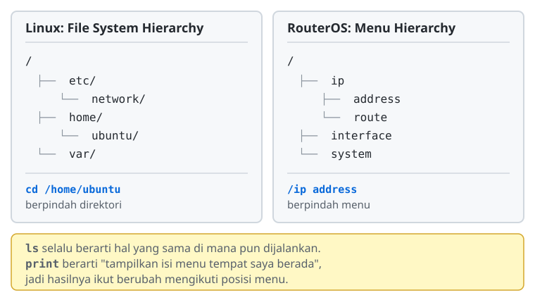
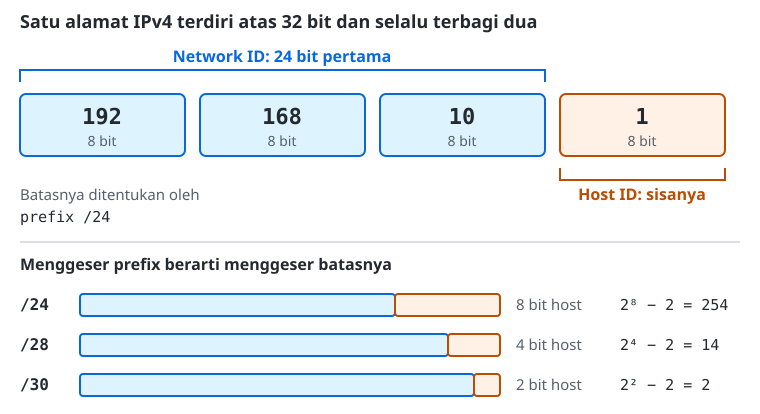
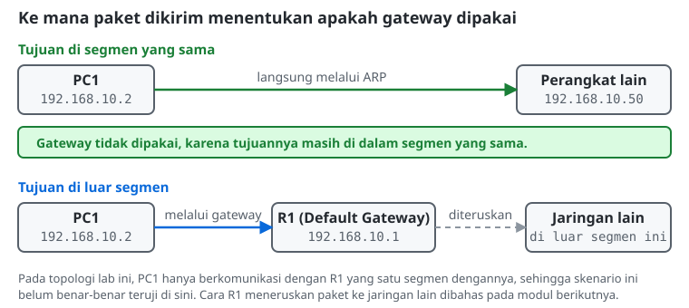
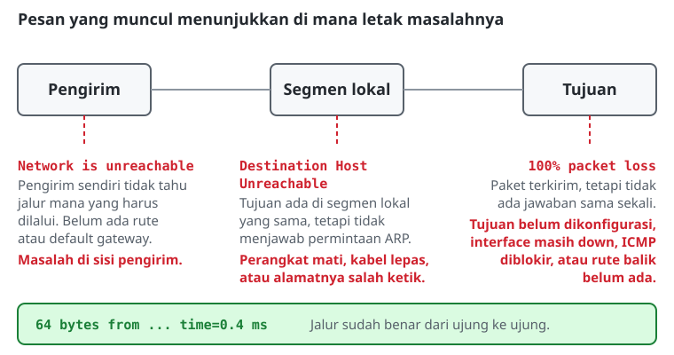

# Eksplorasi CLI dan Pengalamatan IP

## Konsep Dasar CLI
Command Line Interface (CLI) adalah antarmuka berbasis teks, tempat pengguna memberi perintah kepada sistem dengan mengetikkannya. Di dunia jaringan, CLI lebih disukai daripada Graphical User Interface (GUI) karena ringan, cepat, dan tetap stabil ketika diakses dari jarak jauh melalui koneksi dengan *bandwidth* kecil (misalnya via SSH). Hindari Telnet, karena protokol tersebut mengirim seluruh data, termasuk *password*, sebagai *plain text* yang mudah disadap.

## Mengapa Administrator Menggunakan CLI?
GUI memang terlihat lebih modern dan mudah dipakai, tetapi seorang *Network Engineer* justru lebih sering bekerja dengan CLI. Alasannya:
1. **Otomatisasi dan scripting:** Perintah CLI bisa disimpan sebagai file teks lalu dijalankan otomatis ke ratusan router sekaligus. Langkah-langkah di GUI tidak bisa diotomatiskan semudah itu.
2. **Kecepatan eksekusi:** Mengetik beberapa baris perintah jauh lebih cepat daripada membuka menu, mengklik, dan menyimpan pengaturan satu per satu.
3. **Pesan error yang spesifik:** Ketika terjadi kesalahan, CLI menampilkan pesan error yang jelas dan bisa dicatat sebagai log, sehingga proses *troubleshooting* menjadi lebih terarah.

## Arsitektur Sistem: Linux vs MikroTik RouterOS
Keduanya sama-sama CLI, tetapi cara berpikirnya berbeda:

*   **Linux (Bash Shell):**
    Linux memakai konsep *File System Hierarchy*: hampir semua hal diperlakukan sebagai file. Perpindahan direktori dilakukan dengan `cd`, sedangkan isinya dilihat dengan `ls`. Konfigurasi jaringan dilakukan dengan menyunting file teks (misalnya `/etc/network/interfaces` atau Netplan) atau menjalankan perintah seperti `ip`.

*   **MikroTik RouterOS:**
    RouterOS memakai konsep *Menu Hierarchy*. Yang berpindah bukan folder, melainkan menu pengaturan. Dari posisi root (`/`), mengetik `ip address` akan membuka sub-menu IP. Perintah di RouterOS bersifat *context-aware*: ketika sedang berada di menu `/ip/address`, perintah yang tersedia hanya yang relevan dengan alamat IP.

## Tips Eksplorasi
Menghafal seluruh perintah tidak diperlukan. RouterOS menyediakan beberapa fitur bantuan bawaan:
*   **Tombol `Tab` (Auto-Complete):** Tidak perlu mengetik `interface` sampai selesai. Ketik `int` lalu tekan `Tab`, sistem akan melengkapinya. Cara ini mencegah salah ketik sekaligus mempercepat pekerjaan.
*   **Safe Mode (`CTRL + X`):** Tekan `CTRL + X` sebelum melakukan perubahan yang berisiko. Jika koneksi terputus (misalnya karena salah mengatur IP), router secara otomatis membatalkan perubahan tersebut dan kembali ke kondisi terakhir yang aman. Tekan `CTRL + X` sekali lagi untuk menyimpan perubahan secara permanen.

## Konfigurasi Awal pada Router Baru

Router dengan pengaturan bawaan pabrik belum siap dipakai di jaringan produksi. Beberapa langkah berikut hampir selalu dikerjakan lebih dulu:

1. **Hostname.** Semua router MikroTik bernama `MikroTik` secara bawaan. Begitu ada lebih dari satu perangkat yang dikelola, *prompt* yang seragam membuat perintah rawan dijalankan di router yang keliru.
2. **Banner MOTD.** Pesan yang muncul setiap kali seseorang masuk ke router. Banner tidak menghalangi akses, tetapi menyatakan kepemilikan dan peringatan secara tegas, sehingga pihak yang masuk tanpa izin tidak bisa berdalih tidak tahu. Banyak organisasi mewajibkannya untuk keperluan audit.
3. **User dan hak akses.** Jangan biarkan semua orang memakai user `admin` yang berhak mengubah apa pun. Buat user terpisah dengan group yang sesuai dengan tugas masing-masing. Prinsip ini disebut *least privilege*: beri hak seminimal yang dibutuhkan.
4. **Mematikan layanan yang tidak dipakai.** Setiap layanan yang menyala adalah pintu masuk tambahan. Telnet dan FTP mengirim password sebagai *plain text*, jadi keduanya sebaiknya dimatikan. Perlu diingat, mematikan sebuah layanan juga bisa memutus jalur akses yang sedang dipakai, jadi periksa dulu jalur mana yang sedang aktif.

> **Kapan Safe Mode benar-benar berguna?** Sejauh ini Safe Mode baru dicoba tanpa risiko nyata. Begitu ada konfigurasi IP address dan routing, satu kesalahan bisa memutus akses ke router. Di situlah Safe Mode benar-benar berguna.

## Konsep Dasar Pengalamatan IP
Alamat IP (Internet Protocol) adalah identitas numerik yang dipasang pada setiap perangkat jaringan, mirip dengan alamat rumah, supaya perangkat bisa saling mengenali dan bertukar paket data. Tanpa alamat IP, PC, router, maupun server tidak memiliki cara untuk saling menghubungi.

## Anatomi Alamat IPv4
Sebuah alamat IPv4 terdiri atas 32 bit yang ditulis sebagai empat blok desimal (oktet). Setiap alamat selalu terbagi menjadi dua bagian:
1. **Network ID:** identitas jaringan tempat perangkat berada, ibarat nama jalan.
2. **Host ID:** identitas perangkat itu sendiri di dalam jaringan, ibarat nomor rumah.

Batas antara kedua bagian tersebut ditentukan oleh **Subnet Mask** atau **Prefix Length**, misalnya `/24` yang setara dengan `255.255.255.0`.

## Aturan Pengalamatan (Alamat Khusus)
Di dalam satu segmen jaringan, tidak semua alamat boleh dipasang ke perangkat:
*   **Alamat Network** (contoh: `192.168.10.0`): alamat pertama, dengan seluruh bit Host ID bernilai 0. Alamat ini mewakili jaringannya sendiri, jadi tidak bisa dipasang ke perangkat.
*   **Alamat Broadcast** (contoh: `192.168.10.255`): alamat terakhir, dengan seluruh bit Host ID bernilai 1. Alamat ini dipakai untuk mengirim paket ke semua perangkat di jaringan tersebut sekaligus, jadi juga tidak bisa dipasang ke perangkat.
*   **Alamat Host** (contoh: `192.168.10.1` sampai `192.168.10.254`): alamat di antara keduanya. Inilah yang boleh dipasang pada interface PC atau router.

## Default Gateway
Selain alamat IP dan subnet mask, satu parameter lagi biasa dipasang bersamaan pada sebuah perangkat: **default gateway**, yaitu alamat router yang dituju setiap kali sebuah paket hendak dikirim ke luar segmennya sendiri. Pada topologi yang hanya terdiri atas satu segmen, seperti PC1 dan R1 di sini, default gateway belum benar-benar teruji karena tujuannya masih berada di segmen yang sama. Meskipun begitu, default gateway tetap dipasang sebagai bagian standar dari konfigurasi IP sebuah perangkat, karena tanpanya perangkat tersebut tidak tahu harus berbuat apa begitu ada tujuan di luar segmennya. Cara router membaca tabel routing dan memilih next-hop dibahas lebih lanjut pada modul berikutnya.

## Menghitung Rentang Alamat

Untuk mengetahui berapa banyak host yang bisa ditampung sebuah jaringan:

**Jumlah Host = 2^(32 − prefix) − 2**

Angka 2 dikurangkan karena alamat network dan broadcast tidak bisa dipakai.

| Network | Prefix | Perhitungan | Jumlah Host | Rentang Alamat Host |
|---|---|---|---|---|
| 192.168.10.0 | /24 | 2^8 − 2 | **254** | 192.168.10.1 – 192.168.10.254 |
| 172.16.5.0 | /28 | 2^4 − 2 | **14** | 172.16.5.1 – 172.16.5.14 |
| 10.10.10.0 | /30 | 2^2 − 2 | **2** | 10.10.10.1 – 10.10.10.2 |

Contoh membaca tabel: pada `/28`, sisa bit untuk host adalah 32 − 28 = 4 bit, sehingga ada 2^4 = 16 alamat. Dikurangi alamat network (`172.16.5.0`) dan broadcast (`172.16.5.15`), tersisa 14 alamat yang bisa dipakai.

Prefix `/30` sering dipakai pada link *point-to-point* antar-router karena hanya membutuhkan dua alamat host, sehingga tidak ada alamat yang terbuang.

## Membaca Hasil Ping
`ping` (protokol ICMP) dipakai untuk menguji apakah sebuah alamat bisa dijangkau. Hasilnya perlu dibaca dengan teliti, karena dari situ letak masalahnya bisa dipersempit:
*   **Ada balasan (*reply*):** jalur sudah benar dari ujung ke ujung. Perhatikan juga waktu tempuhnya (`time=`).
*   **Tidak ada balasan sama sekali, ringkasan menunjukkan `100% packet loss`:** paket terkirim tetapi tidak ada jawaban. Penyebab tersering adalah tujuan belum dikonfigurasi, interface masih *down*, atau ada firewall yang memblokir ICMP di sisi penerima.
*   **`Destination Host Unreachable`:** perangkat tujuan berada di segmen lokal yang sama, tetapi tidak menjawab permintaan ARP. Biasanya perangkatnya mati, kabelnya lepas, atau alamatnya salah ketik.
*   **`Network is unreachable`:** perangkat pengirim tidak tahu harus mengirim paket ke mana. Artinya belum ada rute maupun *default gateway* yang cocok. Ini masalah di sisi pengirim, bukan di sisi tujuan.

## Referensi Perintah
### Linux (Ubuntu)

| Aksi / Fungsi | Perintah | Keterangan |
|---|---|---|
| Melihat user aktif | `whoami` | Menampilkan nama user yang sedang aktif. |
| Melihat direktori saat ini | `pwd` | (*Print Working Directory*) Menampilkan lokasi direktori saat ini. |
| Melihat isi direktori | `ls -la` | Menampilkan seluruh file secara detail, termasuk *hidden file*. |
| Melihat info sistem | `uname -a` | Menampilkan informasi sistem operasi dan kernel. |
| Melihat proses berjalan | `ps aux` | Menampilkan seluruh proses yang sedang berjalan. |
| Membuat user baru | `sudo useradd <nama>` | Membuat user baru pada sistem. |
| Menambahkan IP sementara | `sudo ip addr add <ip/prefix> dev <nama-interface>` | Bersifat sementara; hilang setelah *restart*. |
| Mengaktifkan interface | `sudo ip link set <nama-interface> up` | Interface baru berstatus *down* secara default. |
| Menambahkan default gateway | `sudo ip route add default via <ip-gateway>` | Semua tujuan yang tidak dikenal diserahkan ke gateway ini. |
| Melihat IP dan statusnya | `ip addr show` | - |
| Melihat tabel routing | `ip route` | - |
| Menguji konektivitas | `ping -c 4 <alamat-ip>` | - |

> **Catatan:** Perintah `ip addr add` bersifat sementara. Jika sistem di-*restart*, alamat tersebut hilang. Di lingkungan produksi (misalnya Ubuntu 24.04), konfigurasi IP permanen diatur melalui file YAML milik **Netplan**.

### MikroTik RouterOS

| Aksi / Fungsi | Perintah | Keterangan |
|---|---|---|
| Naik satu tingkat menu | `..` | - |
| Kembali ke root menu | `/` | - |
| Melihat statistik sistem | `/system resource print` | Menampilkan statistik sistem (CPU, RAM, arsitektur board). |
| Mengubah hostname | `/system identity set name=<nama>` | Mengubah nama atau identitas router (*hostname*). |
| Memasang banner MOTD | `/system note set note="<teks>" show-at-login=yes` | Teks berspasi wajib diapit tanda kutip. |
| Menambahkan user baru | `/user add name=<nama> password=<pass> group=<group>` | Group `read` hanya bisa membaca, `full` bisa mengubah apa pun. |
| Melihat status layanan | `/ip service print` | Menampilkan layanan jaringan router beserta statusnya. |
| Mematikan layanan | `/ip service set <nama> disabled=yes` | Misalnya `telnet` atau `ftp`. |
| Melihat daftar interface | `/interface print` | Menampilkan daftar interface yang tersedia. |
| Mencadangkan konfigurasi | `/export` | Menampilkan seluruh konfigurasi router dalam bentuk skrip teks. |
| Menambahkan IP address | `/ip address add address=<ip/prefix> interface=<nama-interface>` | Prefix wajib ditulis, misalnya `/24`. |
| Melihat daftar IP | `/ip address print` | Pastikan tidak ada flag `I` (*Invalid*); flag itu muncul jika interface-nya belum aktif. |
| Menguji konektivitas | `/ping <alamat-ip> count=4` | - |
