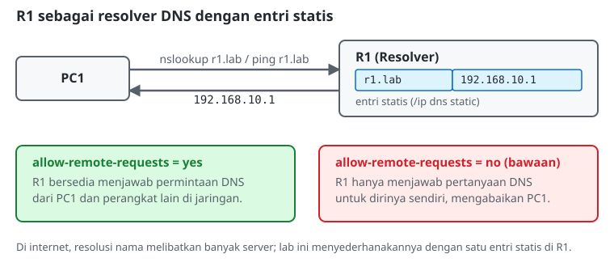

# Konfigurasi DNS

## Mengapa Alamat IP Saja Tidak Cukup
Dua perangkat yang sudah dipasangi IP address statis dan saling terhubung sudah bisa berkomunikasi, asalkan alamat IP tujuan diketahui persis. Masalahnya, manusia tidak menghafal alamat IP. Bayangkan mengakses situs atau server internal dengan mengetik deretan angka setiap kali, dan deretan itu berubah begitu servernya dipindahkan. *Domain Name System* (DNS) menyelesaikan masalah ini dengan menerjemahkan nama yang mudah diingat (misalnya `r1.lab`) menjadi alamat IP yang sebenarnya dipakai untuk mengirim paket.

## Cara Kerja DNS (Ringkas)
Di internet, penerjemahan nama dilakukan secara bertingkat: sebuah *resolver* (biasanya milik ISP atau penyedia publik seperti `8.8.8.8`) menerima pertanyaan "IP dari nama X berapa?", lalu meneruskannya ke server yang berwenang atas nama tersebut jika belum tahu jawabannya sendiri, dan hasilnya disimpan sementara (*cache*) agar pertanyaan yang sama tidak perlu diulang. Pada jaringan kecil, hierarki tersebut bisa disederhanakan: sebuah router dijadikan resolver DNS dengan **entri statis**, cukup untuk memetakan nama ke IP tanpa perlu membangun infrastruktur DNS publik.

## DNS Server pada MikroTik RouterOS
RouterOS mempunyai menu `/ip dns` yang bisa berperan sebagai resolver:
*   **Entri statis** (`/ip dns static add`): memetakan satu nama ke satu alamat IP secara manual, mirip baris di file `/etc/hosts` pada Linux.
*   **`allow-remote-requests=yes`**: tanpa opsi ini, router hanya menjawab pertanyaan DNS dari dirinya sendiri. Mengaktifkan opsi ini membuat router bersedia menjawab pertanyaan dari perangkat lain di jaringan, sehingga router tersebut bisa berperan sebagai resolver bagi klien-klien lain.

## Mengarahkan Klien ke DNS Server
Di Linux, resolver yang dipakai sebuah sistem diatur melalui `/etc/resolv.conf`, sebuah file teks berisi baris `nameserver <alamat-ip>`. Setiap kali aplikasi perlu menerjemahkan sebuah nama, sistem operasi membaca file ini dan mengirim pertanyaan ke alamat yang tercantum. Seperti halnya IP address sementara yang dipasang melalui `ip addr add`, penyuntingan langsung ini juga bersifat sementara, tetapi cukup untuk kebutuhan lab ini.

## Menguji Resolusi Nama
Dua cara paling langsung untuk membuktikan DNS bekerja:
*   **`nslookup <nama>`**: bertanya ke resolver dan menampilkan alamat IP yang didapat, tanpa mengirim paket apa pun ke tujuan. Cocok untuk memeriksa resolusi nama secara terpisah dari konektivitas.
*   **`ping <nama>`**: jika nama berhasil diterjemahkan, ping akan menampilkan alamat IP hasil terjemahan di baris pertama sebelum mencoba menjangkaunya. Jika nama gagal diterjemahkan, pesannya adalah `Name or service not known` atau serupa, bukan `100% packet loss`. Pesan tersebut menunjukkan bahwa masalahnya ada pada resolusi nama, bukan pada jalur jaringan.

## Referensi Perintah
### MikroTik RouterOS

| Aksi / Fungsi | Perintah | Keterangan |
|---|---|---|
| Mengizinkan permintaan DNS dari luar | `/ip dns set allow-remote-requests=yes` | Tanpa ini, router hanya menjawab pertanyaan DNS dari dirinya sendiri. |
| Menambahkan entri DNS statis | `/ip dns static add name=<nama> address=<ip>` | Memetakan satu nama ke satu alamat IP. |
| Melihat pengaturan DNS | `/ip dns print` | Menampilkan server upstream dan status `allow-remote-requests`. |
| Melihat entri statis | `/ip dns static print` | - |

### Linux (Ubuntu)

| Aksi / Fungsi | Perintah | Keterangan |
|---|---|---|
| Mengatur DNS server | `echo "nameserver <alamat-ip>" \| sudo tee /etc/resolv.conf` | Bersifat sementara, sama seperti pengaturan IP address dengan `ip addr add`. |
| Menguji resolusi nama | `nslookup <nama>` | Menampilkan hasil terjemahan nama tanpa menguji konektivitas. |
| Menguji nama sekaligus konektivitas | `ping <nama>` | Gagal dengan `Name or service not known` jika resolusi namanya bermasalah. |
