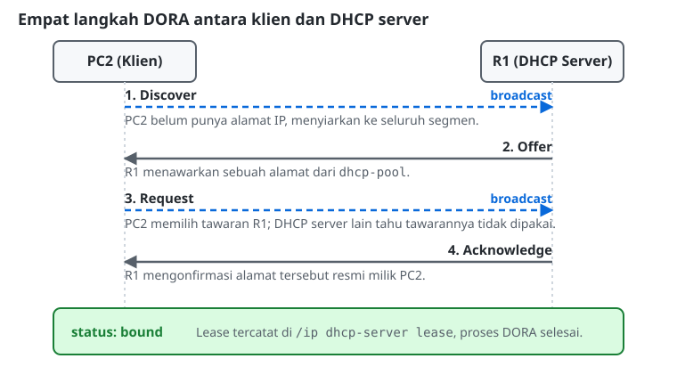

# Konfigurasi DHCP Server & Client

## Masalah yang Diselesaikan DHCP
Memasang IP address secara statis, satu perintah untuk satu perangkat, masuk akal untuk dua atau tiga perangkat, tetapi bayangkan sebuah kantor dengan seratus PC. Memasang IP satu per satu, mencatatnya agar tidak ada yang bentrok, lalu memperbarui catatan itu setiap kali ada PC baru atau pindah ruangan, adalah pekerjaan yang lambat dan rawan kesalahan manusia, misalnya dua PC yang tanpa sengaja dipasangi IP yang sama. *Dynamic Host Configuration Protocol* (DHCP) membuat seluruh proses ini berjalan secara otomatis: begitu PC dinyalakan dan tersambung ke jaringan, PC tersebut meminta konfigurasi (IP address, subnet mask, gateway, bahkan DNS server) dan langsung mendapatkannya dari sebuah DHCP server.

## Proses DORA
Permintaan dan pemberian alamat DHCP terjadi melalui empat langkah, disingkat **DORA**:
1. **Discover:** klien yang baru menyala belum mempunyai alamat IP, sehingga ia menyiarkan (*broadcast*) pertanyaan "adakah DHCP server di jaringan ini?" ke seluruh segmen.
2. **Offer:** setiap DHCP server yang mendengar tawaran itu membalas dengan sebuah alamat IP yang tersedia dari pool miliknya.
3. **Request:** klien memilih salah satu tawaran (biasanya yang pertama diterima) dan secara eksplisit meminta alamat tersebut, juga melalui broadcast, supaya DHCP server lain yang ikut menawarkan tahu bahwa tawaran mereka tidak dipakai.
4. **Acknowledge:** DHCP server yang tawarannya dipilih mengonfirmasi alamat tersebut resmi menjadi milik klien, dan mencatatnya sebagai *lease* (pinjaman) dengan masa berlaku tertentu.

## Kosakata DHCP pada MikroTik RouterOS
Konfigurasi DHCP server pada RouterOS melibatkan tiga menu:
*   **Pool (`/ip pool`):** kumpulan alamat IP yang boleh dipinjamkan, ditulis sebagai rentang, misalnya `192.168.20.10-192.168.20.20`.
*   **DHCP Server (`/ip dhcp-server`):** mengikat sebuah pool ke sebuah interface. Router mendengarkan permintaan DHCP pada interface tersebut dan menawarkan alamat dari pool yang terikat.
*   **Network (`/ip dhcp-server network`):** informasi tambahan yang ikut dikirim bersama alamat IP saat *Acknowledge*, yaitu gateway dan DNS server. Tanpa ini, klien memang mendapat alamat IP, tetapi tidak tahu ke mana harus mengirim paket keluar segmen atau ke mana harus bertanya soal nama.

Perhatikan bahwa opsi `dns-server` pada menu Network bisa diisi dengan alamat router itu sendiri, apabila router tersebut juga difungsikan sebagai resolver DNS. Dengan begitu, klien yang mendapat alamat melalui DHCP secara otomatis ikut mendapat resolver DNS yang benar, tanpa perlu menyunting `/etc/resolv.conf` secara manual.

## Lease: Bukti Sebuah Permintaan Berhasil
Setiap alamat yang berhasil dipinjamkan tercatat di `/ip dhcp-server lease`, lengkap dengan alamat MAC peminjam dan status peminjaman: `waiting` (baru ditawarkan, belum dikonfirmasi), atau `bound` (sudah dikonfirmasi dan sedang dipakai). Status `bound` menandakan proses DORA sudah berhasil sampai akhir.

## DHCP Client pada Linux
Di sisi klien, `dhcpcd` adalah program yang menjalankan proses DORA: menyiarkan Discover, menerima Offer, mengirim Request, lalu menerapkan alamat, gateway, dan DNS server yang didapat pada interface yang diminta. Setelah berhasil, `ip addr show` akan menampilkan alamat dengan penanda `dynamic` (berbeda dari alamat statis yang dipasang manual), dan `/etc/resolv.conf` terisi secara otomatis oleh `dhcpcd` sesuai DNS server yang dikirim DHCP server.

## Referensi Perintah
### MikroTik RouterOS

| Aksi / Fungsi | Perintah | Keterangan |
|---|---|---|
| Membuat address pool | `/ip pool add name=<nama> ranges=<ip-awal>-<ip-akhir>` | Kumpulan alamat yang boleh dipinjamkan. |
| Membuat DHCP server | `/ip dhcp-server add name=<nama> interface=<interface> address-pool=<nama-pool>` | Mengikat sebuah pool ke sebuah interface. |
| Mengatur network DHCP | `/ip dhcp-server network add address=<network/prefix> gateway=<ip> dns-server=<ip>` | Informasi tambahan yang dikirim bersama alamat IP. |
| Melihat daftar lease | `/ip dhcp-server lease print` | Periksa kolom `status`: `waiting` atau `bound`. |

### Linux (Ubuntu)

| Aksi / Fungsi | Perintah | Keterangan |
|---|---|---|
| Meminta alamat IP otomatis | `sudo dhcpcd <nama-interface>` | Menjalankan proses DORA pada interface tersebut. |
| Melihat IP dan asalnya | `ip addr show <nama-interface>` | Alamat dari DHCP ditandai `dynamic`, berbeda dari alamat statis. |
| Melihat DNS server aktif | `cat /etc/resolv.conf` | Terisi secara otomatis oleh `dhcpcd` sesuai DNS server dari DHCP. |
