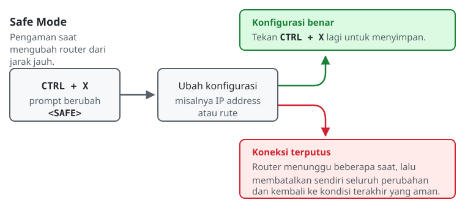

# Pengenalan Command Line Interface (CLI)

## Konsep Dasar CLI
Command Line Interface (CLI) adalah antarmuka berbasis teks, tempat pengguna memberi perintah kepada sistem dengan mengetikkannya. Di dunia jaringan, CLI lebih disukai daripada Graphical User Interface (GUI) karena ringan, cepat, dan tetap stabil ketika diakses dari jarak jauh melalui koneksi dengan *bandwidth* kecil (misalnya via SSH). Hindari Telnet, karena protokol tersebut mengirim seluruh data, termasuk *password*, sebagai *plain text* yang mudah disadap.

## Mengapa Administrator Menggunakan CLI?
GUI memang terlihat lebih modern dan mudah dipakai, tetapi seorang *Network Engineer* justru lebih sering bekerja dengan CLI. Alasannya:
1. **Otomatisasi dan scripting:** Perintah CLI bisa disimpan sebagai file teks lalu dijalankan otomatis ke ratusan router sekaligus. Langkah-langkah di GUI tidak bisa diotomatiskan semudah itu.
2. **Kecepatan eksekusi:** Mengetik beberapa baris perintah jauh lebih cepat daripada membuka menu, mengklik, dan menyimpan pengaturan satu per satu.
3. **Pesan error yang spesifik:** Ketika terjadi kesalahan, CLI menampilkan pesan error yang jelas dan bisa dicatat sebagai log, sehingga proses *troubleshooting* menjadi lebih terarah.

## Arsitektur Sistem: Linux vs MikroTik RouterOS
Keduanya sama-sama CLI, tetapi cara berpikirnya berbeda:

*   **Linux (Bash Shell):**
    Linux memakai konsep *File System Hierarchy*: hampir semua hal diperlakukan sebagai file. Perpindahan direktori dilakukan dengan `cd`, sedangkan isinya dilihat dengan `ls`. Konfigurasi jaringan dilakukan dengan menyunting file teks (misalnya `/etc/network/interfaces` atau Netplan) atau menjalankan perintah seperti `ip`.

*   **MikroTik RouterOS:**
    RouterOS memakai konsep *Menu Hierarchy*. Yang berpindah bukan folder, melainkan menu pengaturan. Dari posisi root (`/`), mengetik `ip address` akan membuka sub-menu IP. Perintah di RouterOS bersifat *context-aware*: ketika sedang berada di menu `/ip/address`, perintah yang tersedia hanya yang relevan dengan alamat IP.

## Tips Eksplorasi
Menghafal seluruh perintah tidak diperlukan. RouterOS menyediakan beberapa fitur bantuan bawaan:
*   **Tombol `Tab` (Auto-Complete):** Tidak perlu mengetik `interface` sampai selesai. Ketik `int` lalu tekan `Tab`, sistem akan melengkapinya. Cara ini mencegah salah ketik sekaligus mempercepat pekerjaan.
*   **Safe Mode (`CTRL + X`):** Tekan `CTRL + X` sebelum melakukan perubahan yang berisiko. Jika koneksi terputus (misalnya karena salah mengatur IP), router otomatis membatalkan perubahan tersebut dan kembali ke kondisi terakhir yang aman. Tekan `CTRL + X` sekali lagi untuk menyimpan perubahan secara permanen.

## Konfigurasi Awal pada Router Baru

Router dengan pengaturan bawaan pabrik belum siap dipakai di jaringan produksi. Beberapa langkah berikut hampir selalu dikerjakan lebih dulu:

1. **Hostname.** Semua router MikroTik bernama `MikroTik` secara bawaan. Begitu ada lebih dari satu perangkat yang dikelola, *prompt* yang seragam membuat perintah rawan dijalankan di router yang keliru.
2. **Banner MOTD.** Pesan yang muncul setiap kali seseorang masuk ke router. Banner tidak menghalangi akses, tetapi menyatakan kepemilikan dan peringatan secara tegas, sehingga pihak yang masuk tanpa izin tidak bisa berdalih tidak tahu. Banyak organisasi mewajibkannya untuk keperluan audit.
3. **User dan hak akses.** Jangan biarkan semua orang memakai user `admin` yang berhak mengubah apa pun. Buat user terpisah dengan group yang sesuai dengan tugas masing-masing. Prinsip ini disebut *least privilege*: beri hak seminimal yang dibutuhkan.
4. **Mematikan layanan yang tidak dipakai.** Setiap layanan yang menyala adalah pintu masuk tambahan. Telnet dan FTP mengirim password sebagai *plain text*, jadi keduanya sebaiknya dimatikan. Perlu diingat, mematikan sebuah layanan juga bisa memutus jalur akses yang sedang dipakai, jadi periksa dulu jalur mana yang sedang aktif.

> **Perhatian:** jangan mengubah password user `admin` pada lab ini. Sistem penilaian masuk ke router sebagai `admin` untuk memeriksa hasil konfigurasi, sehingga mengganti passwordnya akan menghentikan seluruh pemeriksaan pada router tersebut.

> **Kapan Safe Mode benar-benar berguna?** Pada modul ini Safe Mode hanya dicoba. Mulai modul berikutnya, setelah ada konfigurasi IP address dan routing, satu kesalahan bisa memutus akses ke router. Di situlah Safe Mode berguna.

## Referensi Perintah
### Linux (Ubuntu)

| Perintah | Keterangan |
|---|---|
| `whoami` | Menampilkan nama user yang sedang aktif. |
| `pwd` | (*Print Working Directory*) Menampilkan lokasi direktori saat ini. |
| `ls -la` | Menampilkan seluruh file secara detail, termasuk *hidden file*. |
| `uname -a` | Menampilkan informasi sistem operasi dan kernel. |
| `ps aux` | Menampilkan seluruh proses yang sedang berjalan. |
| `sudo useradd <nama>` | Membuat user baru pada sistem. |

### MikroTik RouterOS

| Perintah | Keterangan |
|---|---|
| `..` | Naik satu tingkat menu. |
| `/` | Kembali ke root menu. |
| `system resource print` | Menampilkan statistik sistem (CPU, RAM, arsitektur board). |
| `ip address print` | Menampilkan daftar IP address pada router. |
| `system identity set name=<nama>` | Mengubah nama atau identitas router (*hostname*). |
| `system note set note="<teks>" show-at-login=yes` | Memasang banner MOTD yang muncul saat login. Teks berspasi wajib diapit tanda kutip. |
| `user add name=<nama> password=<pass> group=<group>` | Menambahkan user baru. Group `read` hanya bisa membaca, `full` bisa mengubah apa pun. |
| `ip service print` | Menampilkan layanan jaringan router beserta statusnya. |
| `ip service set <nama> disabled=yes` | Mematikan sebuah layanan, misalnya `telnet` atau `ftp`. |
| `interface print` | Menampilkan daftar interface yang tersedia. |
| `/export` | Menampilkan seluruh konfigurasi router dalam bentuk skrip teks. |
