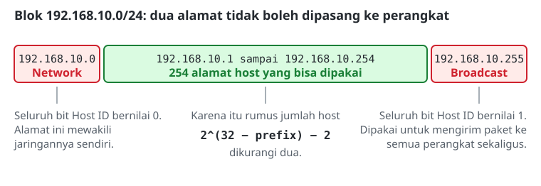
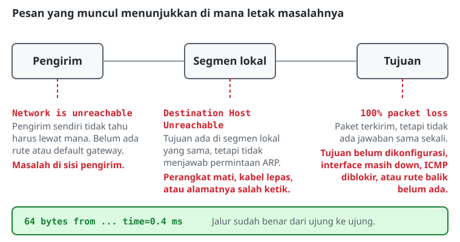

# Konfigurasi IP Address

> **Prasyarat:** Materi ini melanjutkan **Modul 1: Pengenalan CLI**. Pastikan navigasi dan perintah dasar CLI sudah dikuasai sebelum melanjutkan.

## Konsep Dasar Pengalamatan IP
Alamat IP (Internet Protocol) adalah identitas numerik yang dipasang pada setiap perangkat jaringan, mirip dengan alamat rumah, supaya perangkat bisa saling mengenali dan bertukar paket data. Tanpa alamat IP, PC, router, maupun server tidak memiliki cara untuk saling menghubungi.

## Anatomi Alamat IPv4
Sebuah alamat IPv4 terdiri atas 32 bit yang ditulis sebagai empat blok desimal (oktet). Setiap alamat selalu terbagi menjadi dua bagian:
1. **Network ID:** identitas jaringan tempat perangkat berada, ibarat nama jalan.
2. **Host ID:** identitas perangkat itu sendiri di dalam jaringan, ibarat nomor rumah.

Batas antara kedua bagian tersebut ditentukan oleh **Subnet Mask** atau **Prefix Length**, misalnya `/24` yang setara dengan `255.255.255.0`.

## Aturan Pengalamatan (Alamat Khusus)
Di dalam satu segmen jaringan, tidak semua alamat boleh dipasang ke perangkat:
*   **Alamat Network** (contoh: `192.168.10.0`): alamat pertama, dengan seluruh bit Host ID bernilai 0. Alamat ini mewakili jaringannya sendiri, jadi tidak bisa dipasang ke perangkat.
*   **Alamat Broadcast** (contoh: `192.168.10.255`): alamat terakhir, dengan seluruh bit Host ID bernilai 1. Alamat ini dipakai untuk mengirim paket ke semua perangkat di jaringan tersebut sekaligus, jadi juga tidak bisa dipasang ke perangkat.
*   **Alamat Host** (contoh: `192.168.10.1` sampai `192.168.10.254`): alamat di antara keduanya. Inilah yang boleh dipasang pada interface PC atau router.

## Menghitung Rentang Alamat

Untuk mengetahui berapa banyak host yang bisa ditampung sebuah jaringan:

**Jumlah Host = 2^(32 − prefix) − 2**

Angka 2 dikurangkan karena alamat network dan broadcast tidak bisa dipakai.

| Network | Prefix | Perhitungan | Jumlah Host | Rentang Alamat Host |
|---|---|---|---|---|
| 192.168.10.0 | /24 | 2^8 − 2 | **254** | 192.168.10.1 – 192.168.10.254 |
| 172.16.5.0 | /28 | 2^4 − 2 | **14** | 172.16.5.1 – 172.16.5.14 |
| 10.10.10.0 | /30 | 2^2 − 2 | **2** | 10.10.10.1 – 10.10.10.2 |

Contoh membaca tabel: pada `/28`, sisa bit untuk host adalah 32 − 28 = 4 bit, sehingga ada 2^4 = 16 alamat. Dikurangi alamat network (`172.16.5.0`) dan broadcast (`172.16.5.15`), tersisa 14 alamat yang bisa dipakai.

Prefix `/30` sering dipakai pada link *point-to-point* antar-router karena hanya membutuhkan dua alamat host, sehingga tidak ada alamat yang terbuang. Prefix ini mulai dipakai pada Modul 3.

## Membaca Hasil Ping
`ping` (protokol ICMP) dipakai untuk menguji apakah sebuah alamat bisa dijangkau. Hasilnya perlu dibaca dengan teliti, karena dari situ letak masalahnya bisa dipersempit:
*   **Ada balasan (*reply*):** jalur sudah benar dari ujung ke ujung. Perhatikan juga waktu tempuhnya (`time=`).
*   **Tidak ada balasan sama sekali, ringkasan menunjukkan `100% packet loss`:** paket terkirim tetapi tidak ada jawaban. Penyebab tersering adalah tujuan belum dikonfigurasi, interface masih *down*, atau ada firewall yang memblokir ICMP di sisi penerima.
*   **`Destination Host Unreachable`:** perangkat tujuan berada di segmen lokal yang sama, tetapi tidak menjawab permintaan ARP. Biasanya perangkatnya mati, kabelnya lepas, atau alamatnya salah ketik.
*   **`Network is unreachable`:** perangkat pengirim tidak tahu harus mengirim paket ke mana. Artinya belum ada rute maupun *default gateway* yang cocok. Ini masalah di sisi pengirim, bukan di sisi tujuan.

## Referensi Perintah
### MikroTik RouterOS

| Aksi / Fungsi | Perintah | Keterangan |
|---|---|---|
| Menambahkan IP address | `/ip address add address=<ip/prefix> interface=<nama-interface>` | Prefix wajib ditulis, misalnya `/24`. |
| Melihat daftar IP | `/ip address print` | Pastikan tidak ada flag `I` (*Invalid*). |
| Menguji konektivitas | `/ping <alamat-ip> count=4` | - |

### Linux (Ubuntu)

> **Catatan:** Perintah `ip addr add` bersifat sementara. Jika sistem di-*restart*, alamat tersebut hilang. Di lingkungan produksi (misalnya Ubuntu 24.04), konfigurasi IP permanen diatur lewat file YAML milik **Netplan**. Untuk kebutuhan simulasi lab ini, konfigurasi sementara sudah cukup.

| Aksi / Fungsi | Perintah | Keterangan |
|---|---|---|
| Menambahkan IP sementara | `sudo ip addr add <ip/prefix> dev <nama-interface>` | - |
| Mengaktifkan interface | `sudo ip link set <nama-interface> up` | Interface baru berstatus *down* secara default. |
| Melihat IP dan statusnya | `ip addr show` | - |
| Menguji konektivitas | `ping -c 4 <alamat-ip>` | - |
