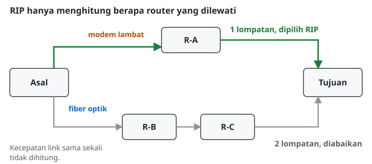
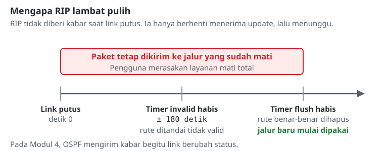
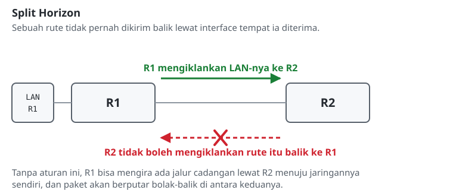

# Konfigurasi Routing RIP

## Konsep Dasar Dynamic Routing
*Dynamic routing* hadir untuk mengatasi dua masalah pada static routing: beban konfigurasi manual, dan ketiadaan jalur cadangan otomatis. Dengan routing dinamis, setiap router menjalankan sebuah protokol yang bertugas bertukar informasi jaringan dengan router tetangganya. Ketika ada perubahan, misalnya kabel putus atau router mati, protokol tersebut menghitung ulang jalur secara otomatis tanpa campur tangan administrator.

## Distance-Vector dan Algoritma Bellman-Ford
Routing Information Protocol (RIP) adalah salah satu protokol tertua, dan termasuk kategori **distance-vector** yang bekerja dengan algoritma Bellman-Ford.
*   **Distance (jarak):** diukur murni dari *hop count*, yaitu berapa banyak router yang harus dilewati. Kecepatan link sama sekali tidak dihitung.
*   **Vector (arah):** ditentukan oleh alamat *next-hop*, yaitu router tetangga mana yang harus dituju.

Akibat dari cara mengukur seperti ini, bagi RIP jalur satu lompatan lewat modem lambat tetap dianggap lebih baik daripada jalur dua lompatan lewat fiber optik.

## Karakteristik dan Keterbatasan RIP
RIP sangat mudah dikonfigurasi, tetapi memiliki keterbatasan yang membuatnya tidak cocok untuk jaringan besar:
1. **Batas maksimal 15 hop:** jaringan yang berjarak 16 lompatan dianggap *unreachable*. Batas ini sekaligus berfungsi sebagai pengaman agar paket tidak berputar tanpa henti saat terjadi *routing loop*.
2. **Update berkala setiap 30 detik:** RIP mengirimkan seluruh isi tabel rutenya setiap 30 detik, baik ada perubahan topologi maupun tidak. Cara ini boros *bandwidth*.
3. **Konvergensi lambat:** ketika sebuah jalur mati, RIP tidak langsung menyadarinya. Ia menunggu beberapa siklus timer (*invalid* lalu *flush*) sebelum rute tersebut benar-benar dihapus. Dalam praktiknya proses ini bisa memakan waktu beberapa menit, dan selama itu lalu lintas masih diarahkan ke jalur yang sudah mati.

Keterbatasan ketiga inilah yang paling terasa di lapangan.

## Mekanisme Pencegah Routing Loop
RIP memakai beberapa aturan agar paket tidak berputar-putar dalam lingkaran tanpa henti:
*   **Split Horizon:** aturan utamanya. Sebuah rute tidak pernah dikirimkan kembali melalui interface yang sama dengan tempat rute itu pertama kali diterima.
*   **Poison Reverse:** variasi dari Split Horizon. Rute tetap dikirim kembali ke interface asalnya, tetapi metriknya sengaja diisi 16 hop, yang berarti *unreachable*. Tujuannya memberi tahu tetangga secara tegas, "jangan lewat saya untuk tujuan ini."

## Catatan Praktis

> **Status legacy:** Di lingkungan *enterprise* maupun ISP modern, RIP praktis sudah ditinggalkan dan digantikan OSPF atau BGP, terutama karena konvergensinya lambat. Meski begitu, RIP tetap dipelajari karena merupakan cara paling sederhana untuk memahami logika *distance-vector*.

> **Hati-hati dengan `redistribute=connected`:** Nilai `connected` pada opsi `redistribute` membuat jaringan lokal ikut diiklankan, dan nilai `rip` membuat rute yang dipelajari dari tetangga diteruskan lagi ke tetangga lain (*transitive propagation*). Di jaringan produksi, mengiklankan semua rute tanpa disaring sangat berbahaya, karena jaringan internal yang seharusnya tertutup bisa ikut tersebar. Solusi yang aman adalah memakai *routing filter* untuk memilih secara spesifik rute mana yang boleh keluar.

> **RIPv2 dan keamanan:** Pada RouterOS v7, *interface template* otomatis mengirim paket dengan **RIPv2**, sehingga subnet `/30` langsung berfungsi tanpa konfigurasi tambahan. Namun router tetap mendengarkan update RIPv1 secara default. Di jaringan produksi, selalu tambahkan `receive=v2 auth=md5 auth-key=<rahasia>` supaya router tidak bisa disusupi rute palsu oleh pihak lain.

## Referensi Perintah
### MikroTik RouterOS v7

Pada RouterOS v7, RIP dikonfigurasi lewat dua objek: *instance* dan *interface template*.

| Aksi / Fungsi | Perintah | Keterangan |
|---|---|---|
| Membuat RIP instance | `/routing rip instance add name=<nama-instance> redistribute=connected,rip` | `connected` mengiklankan jaringan lokal, `rip` meneruskan rute dari tetangga. |
| Menambahkan interface template | `/routing rip interface-template add instance=<nama-instance> interfaces=<daftar-interface>` | Menentukan interface mana yang ikut bertukar informasi RIP. |
| Melihat tabel rute dinamis | `/ip route print` | Rute hasil RIP ditandai flag **DAr** (*Dynamic, Active, RIP*). |
| Melihat detail rute | `/ip route print detail` | Menampilkan `distance`, yang untuk RIP setara dengan jumlah *hop*. |
