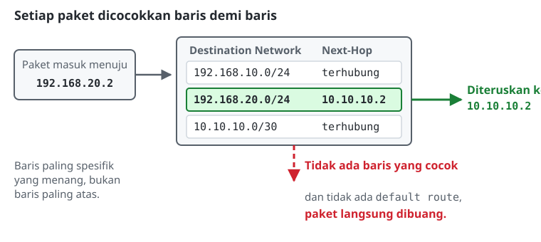
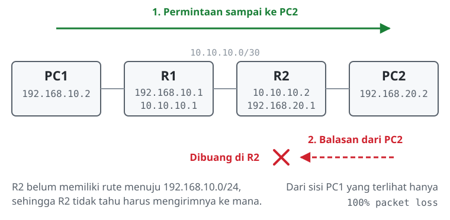

# Konfigurasi Static Routing

> **Prasyarat:** Materi ini melanjutkan **Modul 1: Pengenalan CLI** dan **Modul 2: Konfigurasi IP Address**. Pengalamatan IP harus sudah dikuasai, karena routing baru bisa dibahas setelah setiap interface memiliki alamat.

## Konsep Dasar Routing
Routing adalah proses meneruskan paket data dari satu segmen jaringan ke segmen lain melalui perangkat **router**. Ketika sebuah PC hendak mengirim paket ke alamat di luar jaringannya sendiri, PC tidak akan mencari tujuan itu sendiri, melainkan menyerahkan paketnya ke "pintu keluar" yang sudah ditentukan, yaitu **default gateway**.

## Cara Kerja Tabel Routing
Saat router menerima paket, ia membaca alamat tujuan pada paket tersebut lalu mencocokkannya dengan **tabel routing** miliknya. Tabel routing pada dasarnya adalah peta navigasi. Setiap barisnya berisi minimal dua informasi:
1. **Destination Network:** "jika paket menuju jaringan X..."
2. **Next-Hop (Gateway):** "...teruskan ke router tetangga Y."

Jika tidak ada baris yang cocok dan tidak ada *default route*, paket tersebut dibuang.

## Static Routing vs Dynamic Routing
**Static routing** berarti administrator menuliskan sendiri setiap baris rute ke dalam router.
*   **Kapan static routing cocok dipakai?**
    *   Topologi jaringannya kecil, sekitar satu sampai tiga router.
    *   Dibutuhkan kendali penuh, karena tidak ada paket *update* routing yang dikirim ke jaringan.
    *   *Stub network*, yaitu jaringan ujung yang hanya memiliki satu jalur keluar, misalnya dari router kantor menuju router ISP.
*   **Kelemahan utamanya:**
    *   Beban pengelolaan (*administrative overhead*) naik dengan cepat begitu jaringan membesar. Menambah satu jaringan baru berarti menyunting tabel rute di banyak router sekaligus.
    *   Tidak ada *failover* otomatis. Jika kabel utama putus, rute statis tetap menunjuk ke jalur yang sudah mati dan tidak akan mencari jalur alternatif sendiri. Di jaringan produksi hal ini bisa diringankan dengan parameter `check-gateway=ping`, yang membuat rute otomatis non-aktif jika gateway-nya tidak lagi menjawab.

## Routing Bersifat Satu Arah
Inilah konsep yang paling sering membuat pemula bingung: **routing hanya mengatur satu arah perjalanan.**

Misalkan R1 sudah memiliki rute menuju LAN milik R2. Paket dari sisi R1 sampai ke tujuan tanpa masalah. Persoalannya muncul saat perangkat tujuan mengirim **balasan**: balasan itu adalah paket baru dengan tujuan baru, dan router di sisi seberang harus memiliki rute untuk balasan itu. Jika R2 belum dikonfigurasi dengan rute kembali (*return route*) menuju LAN R1, balasan tersebut dibuang.

Akibatnya mudah dikenali: **ping gagal tanpa pesan error apa pun**. Yang terlihat hanya `100% packet loss`, seolah-olah tujuannya mati. Padahal paketnya sudah sampai; yang hilang adalah jawabannya. Kondisi ini disebut *asymmetric routing*, dan dibuktikan langsung pada Tahap II lab modul ini.

Karena itu, dalam static routing antara dua jaringan, rute selalu dibuat di kedua sisi.

## Referensi Perintah
### Linux (Ubuntu) - End Device

| Aksi / Fungsi | Perintah | Keterangan |
|---|---|---|
| Menambahkan default gateway | `sudo ip route add default via <ip-gateway>` | Semua tujuan yang tidak dikenal diserahkan ke gateway ini. |
| Melihat tabel routing | `ip route` | - |
| Melacak jalur paket | `tracepath <alamat-tujuan>` | Menunjukkan di router mana paket berhenti. Tambahkan `-m <jumlah>` untuk membatasi jumlah hop yang dicoba, berguna ketika jalurnya memang sedang putus. |

### MikroTik RouterOS

| Aksi / Fungsi | Perintah | Keterangan |
|---|---|---|
| Menambahkan rute statis | `/ip route add dst-address=<network-tujuan/prefix> gateway=<ip-next-hop>` | Tambahkan `check-gateway=ping` untuk deteksi kegagalan. |
| Menambahkan default route | `/ip route add dst-address=0.0.0.0/0 gateway=<ip-isp>` | - |
| Melihat tabel routing | `/ip route print` | Rute statis yang aktif ditandai flag **As**. |
