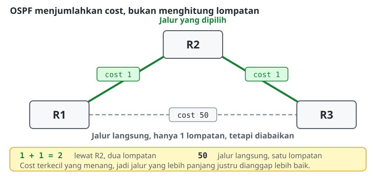
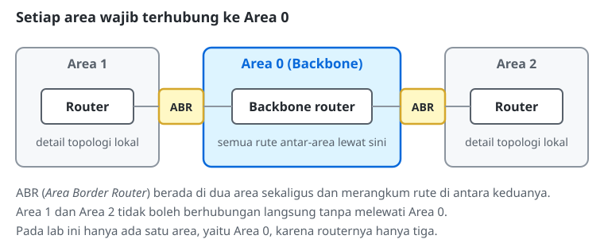
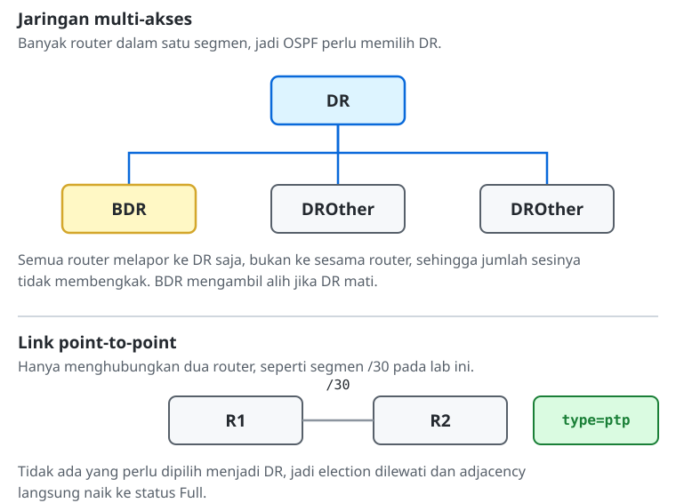
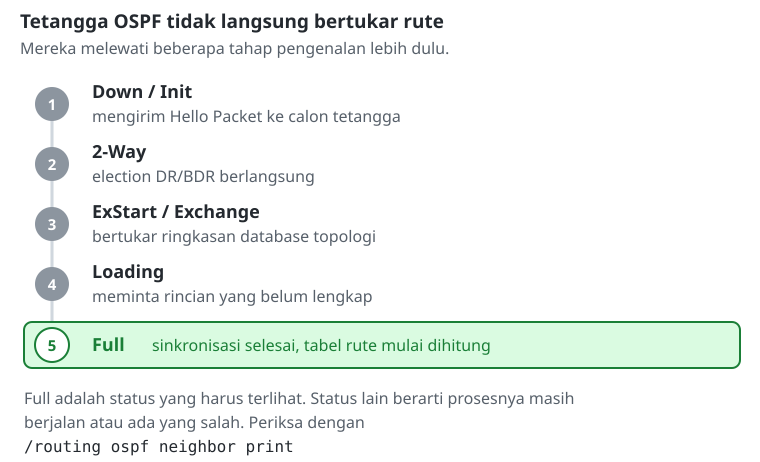

# Konfigurasi Routing OSPF

> **Prasyarat:** Materi ini melanjutkan **Modul 4: Konfigurasi Routing RIP**. Pemahaman *Distance Vector* pada RIP akan menjadi pembanding untuk memahami pendekatan *Link-State* pada OSPF.

## Konsep Dasar Algoritma Link-State
Open Shortest Path First (OSPF) adalah standar utama untuk *dynamic routing* di lingkungan perusahaan, dan termasuk kategori **link-state protocol**.
Berbeda dengan RIP yang hanya menyalin tabel rute milik tetangga, OSPF mengumpulkan informasi rinci tentang status setiap interface (kecepatan, alamat IP, sedang *up* atau *down*) dari **seluruh** router di jaringan, lewat paket LSA (*Link-State Advertisement*).
Hasilnya, setiap router menyimpan *database* (LSDB) yang isinya identik. Dari database itu, masing-masing router menjalankan algoritma **Dijkstra (Shortest Path First)** untuk menyusun peta topologi secara utuh dan menghitung sendiri jalur terbaiknya. Karena setiap router sudah memegang peta lengkap, ia bisa langsung menghitung ulang begitu ada perubahan, tanpa menunggu kabar dari tetangga. Inilah alasan konvergensi OSPF jauh lebih cepat daripada RIP.

## Metrik OSPF: Cost
Inilah perbedaan paling penting antara OSPF dan RIP. OSPF tidak menghitung jarak dari jumlah lompatan, melainkan dari **cost**.
*   Link ber-*bandwidth* besar, misalnya fiber optik, memiliki *cost* kecil.
*   Link lambat, misalnya modem satelit, memiliki *cost* besar.

OSPF menjumlahkan cost seluruh link yang dilewati, lalu memilih jalur dengan total terkecil. Akibatnya, **jalur dengan lebih banyak router bisa saja menang** atas jalur yang lebih pendek, asalkan total cost-nya lebih kecil.

Contohnya persis seperti lab modul ini:

| Jalur | Jumlah Lompatan | Total Cost | Dipilih? |
|---|---|---|---|
| R1 → R3 (link langsung) | 1 | 50 | Tidak |
| R1 → R2 → R3 | 2 | 1 + 1 = 2 | **Ya** |

Jika jaringan ini memakai RIP, jalur pertama pasti menang karena hanya satu lompatan. OSPF memilih yang kedua, karena tahu link langsung tersebut mahal. Cost sebuah interface bisa diatur manual dengan parameter `cost=` pada *interface template*.

## Arsitektur Hierarki: Konsep Area
OSPF dirancang agar tetap sanggup menangani jaringan berisi ribuan router. Jika router sebanyak itu harus terus-menerus bertukar data topologi, CPU-nya akan kewalahan.
Solusinya adalah membagi jaringan menjadi beberapa **Area**.
*   Router hanya perlu mengetahui detail topologi di dalam areanya sendiri (Intra-Area). Rute lintas area akan dirangkum oleh router perbatasan (ABR).
*   **Area 0 (Backbone Area):** Semua desain OSPF harus dimulai dari Area 0. Jika membuat Area 1 dan Area 2, keduanya wajib terhubung ke Area 0.

## DR & BDR (Designated Router)
Pada jaringan multi-akses (seperti *switch* dengan banyak router terhubung), OSPF mencegah terbentuknya ratusan sesi komunikasi antar-router dengan cara melakukan proses *Election*.
*   **Designated Router (DR):** "Ketua Kelas". Semua router hanya melapor (update rute) ke DR.
*   **Backup DR (BDR):** "Wakil Ketua". Mengambil alih jika DR mati.
*   **DROther:** Router biasa yang tidak memenangkan *Election*.
*   **Point-to-Point (tidak ada Election):** Pada link *point-to-point* seperti segmen `/30` antara dua router, DR/BDR *election* tidak berlaku karena link itu hanya menghubungkan dua router. Gunakan parameter `type=ptp` pada *Interface Template* agar OSPF mengenali link ini sebagai *point-to-point*, sehingga adjacency langsung terbentuk ke state **Full** tanpa melalui proses *Election*.

## Status Siklus Adjacency OSPF
Ketika OSPF aktif, router tetangga tidak langsung bertukar tabel routing. Mereka melewati beberapa tahap pengenalan lebih dulu:
1. **Down/Init:** Mengirimkan *Hello Packet* ke router tetangga.
2. **2-Way:** *Election* DR/BDR berlangsung.
3. **ExStart / Exchange:** Bertukar ringkasan database topologi.
4. **Loading:** Meminta rincian data topologi yang belum lengkap.
5. **Full:** Sinkronisasi database selesai, dan perhitungan tabel rute dimulai. Inilah status yang harus terlihat saat *troubleshooting*.

## Referensi Perintah
### MikroTik RouterOS v7

Pada v7, konfigurasi Area tidak lagi terikat di menu *Instance*, melainkan dipisahkan menjadi hierarki yang lebih modular.

| Aksi / Fungsi | Perintah | Keterangan |
|---|---|---|
| Membuat OSPF Instance | `/routing ospf instance add name=<nama-instance> router-id=<ip-id>` | Router wajib memiliki Router ID unik. |
| Mendefinisikan OSPF Area | `/routing ospf area add name=<nama-area> instance=<nama-instance> area-id=<area-id>` | - |
| Menambahkan Interface WAN ke OSPF | `/routing ospf interface-template add area=<nama-area> interfaces=<interface-wan> type=ptp` | Interface WAN: aktif mengirimkan *Hello Packet*. Parameter `type=ptp` wajib untuk mem-bypass *Election* DR/BDR pada link /30. |
| Menandai Interface LAN sebagai Passive | `/routing ospf interface-template add area=<nama-area> interfaces=<interface-lan> passive=yes` | Interface tidak mengirim *Hello Packet*, namun jaringannya **tetap diiklankan** ke seluruh jaringan OSPF melalui LSA. Gunakan pada interface yang terhubung ke perangkat klien (PC) yang tidak menjalankan OSPF. |
| Memverifikasi Status Adjacency (Wajib) | `/routing ospf neighbor print` | Pastikan state **Full**. |
| Memverifikasi Tabel Rute Dinamis | `/ip route print` | Rute OSPF berstatus **DAo** (Dynamic, Active, OSPF). |
