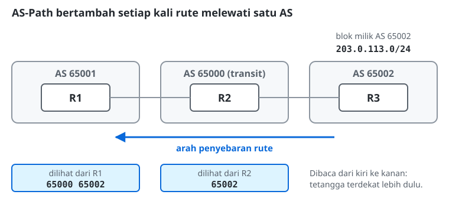
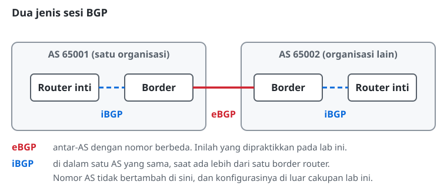

# Konfigurasi Routing BGP

> **Prasyarat:** Materi ini melanjutkan **Modul 5: Konfigurasi Routing OSPF**. Pemahaman IGP pada OSPF diperlukan sebagai pembanding untuk memahami peran BGP sebagai EGP.

## Protokol Tulang Punggung Internet
Border Gateway Protocol (BGP) adalah satu-satunya **Exterior Gateway Protocol (EGP)** yang dipakai di dunia nyata. Protokol lain (seperti RIP dan OSPF) adalah IGP (*Interior Gateway Protocol*) yang tugasnya mencari rute di *dalam* satu jaringan.
BGP bertugas mencari rute di *luar* jaringan sendiri, menghubungkan jaringan ISP lokal menuju ke Google, Meta, atau benua lain. Tanpa BGP, jaringan-jaringan tersebut tidak akan menyatu menjadi satu internet.

## Autonomous System Number (ASN)
BGP tidak melihat dunia sebagai kumpulan router, melainkan kumpulan wilayah administrasi besar yang disebut **Autonomous System (AS)**.
Setiap AS dikelola oleh satu organisasi (misalnya Telkom Indonesia, Cloudflare, Amazon AWS) dan memiliki nomor identitas unik yang berlaku global, disebut ASN.
BGP memakai algoritma **Path-Vector**: jalur terbaik dinilai dari seberapa sedikit AS yang harus dilewati, yang disebut *AS-Path length*.

## Atribut AS-Path

Setiap kali sebuah rute berpindah melewati satu AS, nomor AS tersebut ditambahkan ke dalam daftar yang disebut **AS-Path**. Daftar ini bersifat kumulatif dan terus bertambah di setiap lompatan AS.

Contoh: rute `203.0.113.0/24` milik **AS 65002** melewati **AS 65000** (transit) sebelum sampai ke **AS 65001**. Router di AS 65001 menerima rute tersebut dengan:

```
bgp-as-path=65000,65002
```

Artinya paket dari AS 65001 menuju `203.0.113.0/24` melewati AS 65000 terlebih dahulu. Atribut ini bisa diamati langsung pada output `/ip route print detail` setelah sesi BGP terbentuk.



## Kategori Peering BGP: eBGP vs iBGP
Sesi BGP tidak terbentuk sendiri seperti pada OSPF, melainkan harus didaftarkan satu per satu lewat koneksi TCP port 179. Ada dua jenis sesi:
1. **eBGP (External BGP):** Sesi *peering* antara dua router yang memiliki ASN berbeda. Digunakan saat AS lokal ingin bertukar rute dengan ISP atau AS lain. Ini yang akan dipraktikkan pada lab ini.
2. **iBGP (Internal BGP):** Sesi *peering* antara dua router dalam ASN yang sama. Digunakan saat sebuah AS memiliki lebih dari satu *border router* yang perlu berbagi tabel rute BGP secara internal tanpa mengubah atribut AS-Path. Konfigurasi iBGP berada di luar cakupan lab ini.



## Kebijakan Routing (Routing Policy)
BGP tidak mencari jalur tercepat. BGP memilih jalur berdasarkan ***routing policy***: hubungan bisnis antar-AS dan prioritas yang ditetapkan administrator, bukan performa teknis semata. Arah lalu lintas bisa diatur administrator lewat *BGP Attributes* seperti Local Preference, MED, atau AS-Path Prepend. Contoh: "Gunakan jalur Telkomsel untuk *download*, tetapi jalur Indosat untuk *upload*." Konfigurasi *Routing Policy* berada di luar cakupan lab ini, namun perlu dipahami sejak awal bahwa BGP bekerja atas dasar *policy*, bukan sekadar angka metrik.

## Catatan (Best Practices)

> **Perhatian, Bahaya `output.redistribute=connected`:** Kesalahan umum pemula adalah menggunakan `output.redistribute=connected` pada koneksi BGP karena terlihat lebih singkat. Konfigurasi ini **sangat tidak disarankan** di jaringan produksi karena router akan mengiklankan *seluruh* alamat IP yang terpasang ke jaringan BGP, termasuk IP manajemen, IP loopback, dan subnet internal yang seharusnya tidak diketahui publik. Selalu gunakan `output.network` dengan *Address List* yang eksplisit, seperti yang dipraktikkan pada lab ini. Selain itu, sesi *peering* BGP di jaringan produksi selalu diamankan menggunakan autentikasi (MD5).

## Referensi Perintah
### MikroTik RouterOS v7

Pada RouterOS v7, BGP menggunakan dua objek terpisah: *instance* untuk mendefinisikan identitas AS, dan *connection* untuk mengatur setiap sesi *peer*. Pendekatan ini memberikan fleksibilitas ketika satu router perlu menjalankan beberapa sesi BGP dengan identitas yang sama.

| Aksi / Fungsi | Perintah | Keterangan |
|---|---|---|
| Mendefinisikan Prefix yang Diiklankan | `/ip firewall address-list add list=<nama-list> address=<prefix/length>` | Daftarkan blok IP milik AS ini secara eksplisit sebelum diiklankan via BGP. |
| Membuat BGP Instance | `/routing bgp instance add name=<nama-instance> as=<asn-lokal> router-id=<id-lokal>` | Mendefinisikan identitas AS router. |
| Membangun Koneksi eBGP (Peering) | `/routing bgp connection add name=<nama-koneksi> instance=<nama-instance> local.role=ebgp local.address=<ip-lokal> remote.address=<ip-remote> remote.as=<asn-remote> output.network=<nama-list>` | Wajib isi `local.address` agar sesi BGP terikat ke interface yang benar. Parameter `output.network` mengacu pada *address-list* berisi prefix yang diizinkan diiklankan. Transit AS yang tidak mengiklankan prefix miliknya sendiri tidak perlu parameter ini. |
| Mengecek Status Sesi BGP | `/routing bgp session print` | Status wajib **Established**. Status lain berarti sesi belum terbentuk. |
| Mengecek Tabel Rute Dinamis | `/ip route print detail` | Rute BGP berstatus **DAb** (Dynamic, Active, BGP). Gunakan `detail` untuk melihat atribut **AS-PATH** pada setiap rute. |

> **Catatan Troubleshooting:** Sesi BGP beroperasi melalui koneksi **TCP port 179**. Jika status sesi tidak mencapai *Established*, pastikan tidak ada aturan *firewall* yang memblokir port tersebut. Pada RouterOS, periksa dengan `/ip firewall filter print` dan `/ip firewall connection print`.
