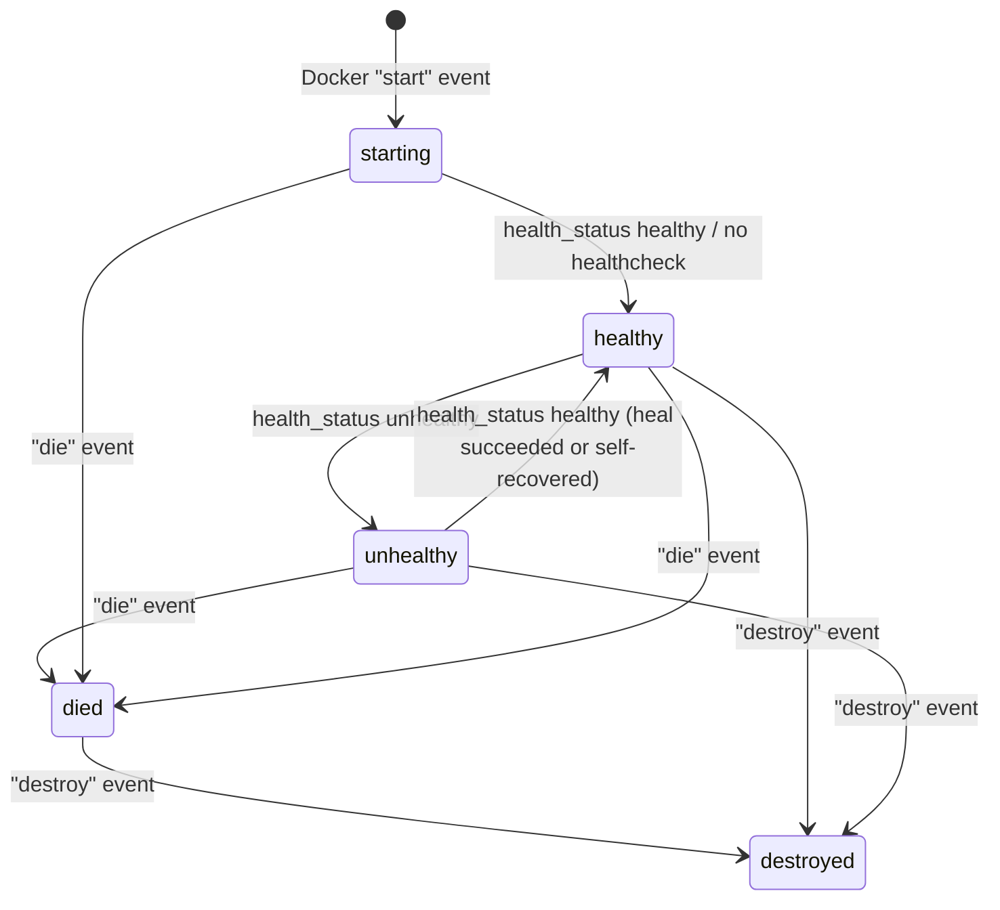
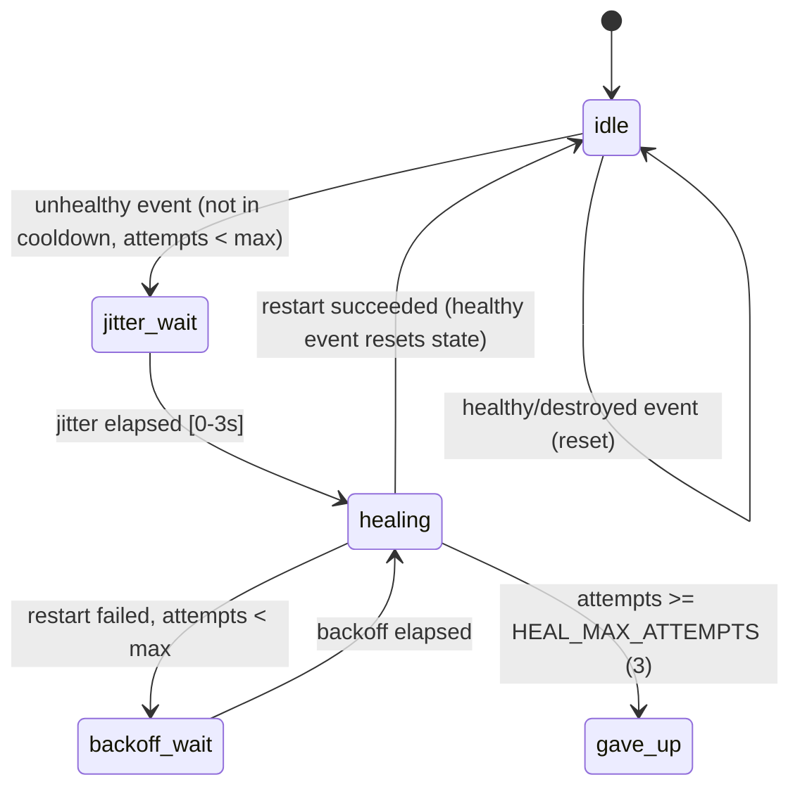

# `@vlab/clab-monitor` — Docker Event → Health/Interface State Engine

`packages/@vlab/clab-monitor` watches the Docker daemon's event stream for containers belonging to Containerlab labs and turns raw Docker events into a typed health state machine plus live network-interface tracking. It also drives the worker's auto-heal logic. Consumed by [`apps/worker`](worker.md) (`lib/monitor.ts`, `services/monitor/index.ts`, `services/monitor/heal.ts`) and by `tests/evaluator-e2e`.

## Files

```
packages/@vlab/clab-monitor/src/
  index.ts            createMonitor(): top-level factory; owns nodeHealths map + healthWaiters + waitForHealth()
  types.ts             NodeHealth, NodeInfo, Context, NetworkMonitor interface, Events
  constants.ts         CLAB_LABELS, NODE_HEALTH_STATUS/HEALTHY_STATUS/TERMINAL_HEALTH_STATUS sets
  exec.ts              docker-exec helpers (execStream/execOutput/execLines)
  utils.ts             formatHealth, extractManagementIp, extractCredentials (re-exported)
  container/
    index.ts            createDockerEventMonitor(): connect/rehydrate/reconnect loop, Docker event stream parsing
    handlers.ts          per Docker-event-type handlers: start/health_status/kill/die/destroy
    utils.ts             formatHealth/extractManagementIp/extractCredentials + KeyedQueue (per-node serialization)
  network/
    index.ts             per-kind dispatcher (read/start/stop/stopAll) + waitForHealth-gated start loop
    linux.ts              `ip -j addr` (one-shot) + `ip -o monitor address` (stream) via docker exec
    mikrotik_ros.ts        RouterOS API (`mikro-routeros`) `/ip/address/print` + `/ip/address/listen`
```

## Health state machine

`NodeHealth = "starting" | "healthy" | "unhealthy" | "died" | "destroyed" | null` (`types.ts`), mirrored on the manager/shared side in `packages/@vlab/shared/src/enums.ts` as `nodeHealthValues` (kept in sync **by convention/comment only**, not by shared import — see [`shared-packages.md`](shared-packages.md) for the duplication risk).

Classification sets (`constants.ts`):

- `HEALTHY_STATUS = {"healthy", null}` — a node with no configured healthcheck reports `null` and is treated as healthy.
- `TERMINAL_HEALTH_STATUS = {"unhealthy", "died", "destroyed"}`.



See also [`../diagrams/node-health-state.mmd`](../diagrams/node-health-state.mmd) for the combined health + auto-heal diagram.

## Event-driven design (`container/index.ts`)

`createDockerEventMonitor()` subscribes to the Docker daemon's event stream filtered to `type: container`, `event: [start, health_status, kill, die, destroy]`.

On `(re)connect`:

1. `docker.getEvents(...)` is opened and the newline-delimited JSON event stream listeners (`data`/`error`/`end`/`close`) are attached **first**, before anything else. Any event that arrives before rehydration finishes is buffered (see below) rather than dropped or raced against.
2. **`rehydrate()`** then runs — lists **all** containers (`docker.listContainers({all:true})`); for every one bearing both `clab-node-kind` and `containerlab` labels: inspects it, computes health via `formatHealth(info.State.Health?.Status)`, resolves its management IP, adds it to the `nodes` set, **emits `health-update`**, and starts its per-kind network monitor.
3. Once `rehydrate()` resolves, any events buffered while it was running are dispatched **in arrival order**, then live events are dispatched immediately from then on.
4. Health/interface events for the same container are serialized through a per-key `KeyedQueue` (`container/utils.ts`) so concurrent Docker events for one node can never race each other, while different nodes process fully in parallel.
5. **Auto-reconnect**: stream `end`/`close`/initial-connect-failure all schedule a reconnect after a fixed `RECONNECT_DELAY = 3_000ms`, guarded by a `reconnecting` flag so overlapping reconnects can't stack. `monitor.stop()` aborts via an `AbortController` and clears the keyed queue.

Per-event handlers (`container/handlers.ts`):

| Docker event      | Effect                                                                             |
| ----------------- | ---------------------------------------------------------------------------------- |
| `start`           | Resolve IP/health, add to `nodes`, emit `health-update`, kick off network monitor. |
| `health_status:*` | Re-emit `health-update` with the parsed sub-state.                                 |
| `kill`            | Remove from `nodes`, stop network monitor.                                         |
| `die`             | Emit `health-update(..., "died")`.                                                 |
| `destroy`         | Emit `health-update(..., "destroyed")`.                                            |

> **No more rehydrate/subscribe gap window**: an earlier version of this code ran `rehydrate()` (the snapshot) **before** subscribing to `docker.getEvents()`, so any container event firing in that window was silently lost with no self-correction until the next reconnect (this was the suspected cause behind a past "health stuck at starting" bug). The current code subscribes first and buffers any events that arrive mid-rehydration (`pending` array in `connect()`), draining them in order once `rehydrate()` resolves — so no event in that window is missed. Buffering rather than processing-during-rehydrate is deliberate: `rehydrate()` mutates the shared `nodes` set and starts/stops network monitors directly, outside the `KeyedQueue`, so handling a live event concurrently with it could race (e.g. a duplicate network monitor for a node rehydrate hasn't reached yet) — `network.start()` happens to guard against that specific duplicate today, but buffering avoids relying on it.

## `waitForHealth` / health cache (`index.ts`)

`createMonitor()` keeps a `nodeHealths: Map<id, NodeHealth>` fed purely by the `"health-update"` event listener, and a `healthWaiters: Map<id, Set<{resolve,reject}>>`.

`waitForHealth(id, {timeout, signal})`:

- Throws synchronously if `id` isn't in the tracked `nodes` set.
- Resolves immediately if already healthy.
- Otherwise registers a waiter resolved on the next `healthy`/`null` transition, or rejected on a terminal transition (`unhealthy`/`died`/`destroyed`), an optional timeout, or `AbortSignal` abort.
- Used both by the network monitors (gating `read`/`start` on the node reaching healthy before touching interfaces) and by `apps/worker`'s evaluator wiring (`monitor.health.wait`, see [evaluator.md](evaluator.md)).

**Design note**: `waitForHealth` does **not** perform a one-shot `docker inspect` reconciliation when the cache looks stale — it only trusts the event-derived cache. The only safety net is `rehydrate()`-on-(re)connect, not a per-call re-check. Combined with the gap-window note above, this means a genuinely missed event has no self-correcting mechanism until the next full reconnect.

## Auto-heal (`apps/worker/src/services/monitor/heal.ts` + `constants.ts`)

Wired in `apps/worker/src/services/monitor/index.ts`: whenever a `health-update` event reports `"unhealthy"`, `heal.trigger(node)` is called; whenever it reports `"healthy" | null | "destroyed"`, `heal.reset(node.id)` clears any in-flight heal state for that node.

- Per-node state: `{ attempts, lastAttemptAt, healing, retryTimer }` in an in-memory `Map` (`states`), keyed by container ID.
- **`trigger()`** no-ops if already healing, if a retry is already scheduled, if within `HEAL_COOLDOWN_MS` (60_000ms) of the last attempt, or if `HEAL_MAX_ATTEMPTS` (3) has already been reached (logs and gives up loudly — no silent infinite retry).
- Otherwise schedules the heal after a **random jitter** of `[0, HEAL_TRIGGER_JITTER_MS)` = `[0, 3_000)` ms — explicitly to avoid a batch of nodes going unhealthy simultaneously (e.g. a multi-lab deploy) from all restarting at once and piling onto host contention. This is the "heal trigger jitter" fix (commit `245018b0`, 2026-07-06).
- **`attempt()`**: increments `attempts`, calls `clab.redeployNode(node.lab, node.name)` (i.e. `containerlab restart --node <name>` — **in-place restart, not full redeploy**). On success, logs and clears the `healing` flag. On failure, if attempts are exhausted it gives up with an error log; otherwise it schedules a further retry via `expBackoff(attempts-1, {base: HEAL_RETRY_BASE_MS=5000, factor: HEAL_RETRY_FACTOR=3, cap: 60000})`.
- **`clearAll()`** (called from `stopMonitorService()`) clears every pending retry timer on daemon shutdown.



**No container-ID drift on heal**: `containerlab restart` is a Docker-level restart of the _same_ container (stop + start in place), not a recreate — the container ID is preserved, so `attempt()`'s re-inspect after a heal restart is purely to confirm the restart succeeded, not to pick up a new identity. This is a deliberate property of using `restart` here instead of a full `redeploy`/recreate (see commit `a98b63a2`, which switched auto-heal from redeploy to restart specifically to avoid this class of drift).

## Network interface monitoring (`network/*`)

Per-kind dispatcher (`network/index.ts`) gates all reads/streams on `waitForHealth()` first — interfaces are never read from a node that isn't healthy yet.

- **`linux.ts`** — one-shot `ip -j addr` (JSON) via `docker exec` for the initial snapshot, then a long-running `ip -o monitor address` stream (also via `docker exec`) parsed line-by-line for live updates.
- **`mikrotik_ros.ts`** — uses the vendored [`mikro-routeros`](shared-packages.md#packagesexternalmikro-routeros) client: `/ip/address/print` for the snapshot, `/ip/address/listen` for the live stream (RouterOS's native "listen" command family, not polling).

Both implementations expose the same `NetworkMonitor` interface (`read`/`start`/`stop`/`stopAll`) so `network/index.ts` can dispatch generically by node `kind`. Streams/listeners are tracked in per-node `Map`s cleaned up symmetrically in `stop()`/`stopAll()`; `network/index.ts` tracks per-node `AbortController`s for the wait-for-health gating.

## Helper functions (`utils.ts`)

- **`formatHealth(dockerHealthStatus)`** — normalizes Docker's raw health string (or absence thereof) into the `NodeHealth` union.
- **`extractManagementIp(inspectData)`** — pulls the management-network IP out of a Docker inspect/event payload.
- **`extractCredentials(env)`** — reads `USERNAME`/`PASSWORD` env vars injected by `apps/worker`'s topology builder (see [worker.md § Topology generation](worker.md#topology-generation-domainlabtopologyts-buildtopology)) so `linux` network/evaluator sources can authenticate over `docker exec`.

## Key types (`types.ts`)

- `NodeHealth` — see state machine above.
- `NodeInfo { id, kind, lab, name }` — the tracked identity of a monitored node.
- `NodeInterfaces = Record<iface, string[]>` — current IP/addr list per interface.
- `Context` — per-node connection context (e.g. an open RouterOS API session) reused across reads.
- `NetworkMonitor { read, start, stop, stopAll }` — the per-kind interface implemented by `linux.ts`/`mikrotik_ros.ts`.
- `Events` — the typed event map (`health-update`, etc.) emitted by the monitor.
