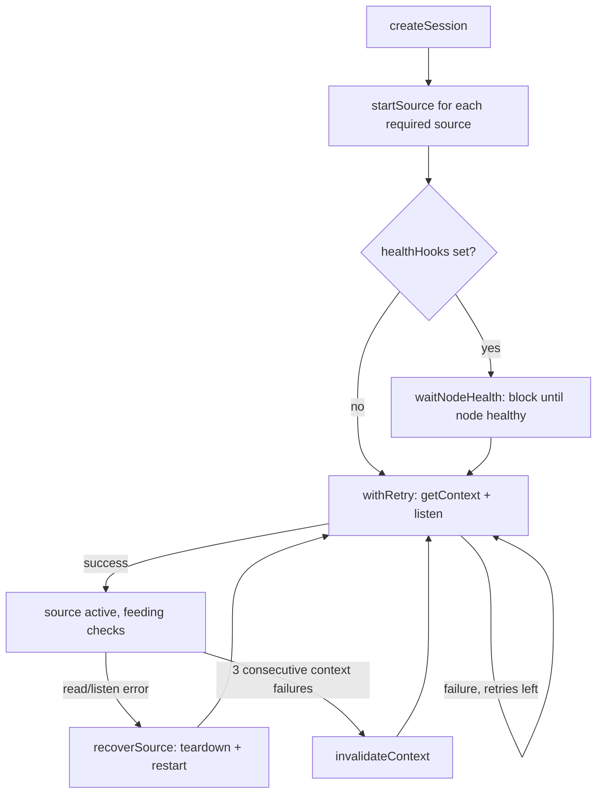

# `@vlab/evaluator` — Automated Lab Grading Engine

`packages/@vlab/evaluator` is an event-driven engine that continuously monitors and grades the live state of lab nodes (containers/network devices) against instructor-defined checks. It runs inside [`apps/worker`](worker.md) (`domain/evaluation/index.ts` wraps it per lab session) and is exercised directly by `tests/evaluator-e2e` (see [testing-ci.md](../testing-ci.md)).

Related: [worker.md](worker.md) · [clab-monitor.md](clab-monitor.md) (health-gated startup) · [course-content.md](../course-content.md) (where check definitions come from)

## Core architecture (`src/base/`)

- **`EvaluationHandler`** (`base/evaluation-handler.ts`) — a builder class per node-kind (`linux`, `mikrotik`, `node-interface`) defining:
  - `.kinds([...])` — which Containerlab kinds it applies to.
  - `.withContext(builder, cleanup)` — how to open/close a connection (e.g. a Docker exec "session" for Linux, a RouterOS API login for MikroTik).
  - `.addSource({...})` — a typed state extractor with `read()` and optional `listen()`.
  - `.addCheck({...})` — a declarative rule bound to one source, with `params`, a boolean `handler()`, and an optional `oneTime` flag to stop listening once passed.
- **`Evaluator`** (`base/evaluator.ts`) — the central registry:
  - `.register(handler)` accumulates handlers.
  - `.getChecks()` returns the full catalog (for the UI check-picker, exposed via the manager's `GET /api/evaluator`).
  - `.setSourceRead()` lets callers override how a source is read (used heavily by tests to inject fake interface data, and by `apps/worker` to source `node-interface.interfaces-ip` from `@vlab/clab-monitor`'s live interface map instead of a generic reader).
  - `.emitSource()` pushes new source data to all subscribed sessions.
  - `.createSession(docker, nodeMapping, checks, healthHooks?, initialValues?)` — the session factory.
- **`EvaluationSession`** (`base/evaluation-session.ts`) — the runtime engine; only connects to/streams from sources that are actually required by the active check set (dependency mapping via `sourceToCheckMap`), debounces reads, and fires `onChange(checkId, passed)` events on pass/fail transitions.

## Reliability / self-healing design

This is the load-bearing part of the package — it's designed so that a session never needs to be manually restarted because a device was slow to boot or a connection blipped. All of the following live in `evaluation-session.ts` + `utils.ts`.

- **`withRetry()`** (`src/utils.ts`) — a generic exponential-backoff-with-jitter retry helper (`retries`, `minDelayMs`, `maxDelayMs`, `factor=2`, abortable via `signal`, `onAttemptFailed` hook). Used inside `startSource()` to wrap context-acquisition + `listen()` setup, configured with:
  - `SOURCE_START_RETRIES = Infinity`
  - `SOURCE_START_MIN_DELAY_MS = 500`
  - `SOURCE_START_MAX_DELAY_MS = 15_000`

  i.e. a source keeps retrying forever (capped backoff) until it connects or the session stops — there's no other reliable signal that a slow-booting node will never come up, so giving up isn't safe.

- **Context failure tracking** — `CONTEXT_FAILURE_THRESHOLD = 3`: after 3 consecutive failures against a cached context (e.g. a stale RouterOS API session), `invalidateContext()` tears it down so the next `getContext()` call rebuilds from scratch (fresh connect+login) rather than endlessly reusing a possibly-broken resource.

- **Source self-healing** — `recoverSource()`: reacting to a source's `reportError` callback or a read exception, it tears down the failed source's listener/emitter registrations and re-invokes `startSource()` to reconnect. Purely reactive, no polling loop.

- **Health-gated startup** — `waitNodeHealth()`: if `healthHooks` are supplied (wired to [`@vlab/clab-monitor`](clab-monitor.md)'s `waitForHealth`), a source won't start until the node reports healthy, and retries through transient "unhealthy" flaps during container boot instead of giving up.

- **Fault isolation in `check()`** — each source's read is wrapped in its own try/catch so one node with a dead context doesn't abort the evaluation cycle for unrelated nodes/sources.

- **`onSourceError()`** — purely observational callback hook; does not itself affect retry/reconnect behavior (that happens unconditionally regardless of whether a callback is registered).

## Supported handlers

Per `packages/@vlab/evaluator/README.md` (cross-check against `tests/evaluator-e2e` suites, which exercise a slightly larger set than the README documents):

- **`linux`**:
  - Source `routing` (`ip -o monitor route`) → check `route-exist` (`dst`, `gateway`).
  - Source `users` (`inotifywait` on `/etc/passwd`) → check `user-exist` (`username`).
- **`mikrotik`** (via [`mikro-routeros`](shared-packages.md#packagesexternalmikro-routeros), using RouterOS `/listen` commands):
  - `routing-table` → `route-exist` (`dst`/`gateway`/`flag`).
  - `ospf-instance` / `ospf-area` / `ospf-interface-template` / `ospf-neighbor` → matching `*-exist` checks.
  - `rip-instance` / `rip-interface-template` → matching checks.
  - `bgp-instance` → `bgp-instance-exist`.
  - `system-identity` → `system-identity` check.
  - Also exercised in `tests/evaluator-e2e` but **not yet in the README table**: `mikrotik.user-exist`, `mikrotik.bgp-connection-exist`, `mikrotik.bgp-session-established` — check the test suite (`tests/evaluator-e2e/src/suites/mikrotik.ts`) as the more current source of truth if the README looks stale.
- **`node-interface`**: generic static handler, source `interfaces-ip` → check `check-ip` (`interface`, `ip`) — used for basic connectivity checks outside container-runtime-specific tooling. In `apps/worker`, its `read` is overridden via `evaluator.setSourceRead()` to source data from `@vlab/clab-monitor`'s live interface map rather than shelling out itself.

## How checks reach the evaluator

1. An instructor authoring a Lab picks checks (per node) in the web UI, sourced from `GET /api/evaluator` (which calls `Evaluator.getChecks()`). These are stored as the Lab's `checks` (`LabChecksMapSchema` — `nodeId`, `checkId`, `params`, `weight`).
2. When a lab session starts, the manager's `domain/lab-session/evaluation.ts` builds a `nodeMap`/`sessionChecks`/initial `values` payload and RPCs `evaluator:start` to the worker (see [protocols/grpc-manager-worker.md](../protocols/grpc-manager-worker.md)).
3. `apps/worker`'s `domain/evaluation/index.ts` calls `evaluator.createSession(...)`, wiring `healthHooks` to the worker's `@vlab/clab-monitor` instance.
4. Each `onChange(checkId, passed)` transition is sent back to the manager as an `evaluator:checkChanged` data event, which the manager persists to `lab_session_check` and relays to the browser over WebSocket (`lab-session:[sessionId]:checks`).
5. On session submit, the manager computes the final weighted score from the accumulated `lab_session_check` rows against the Lab's `checks` weight map.

Course content (`docs/modules/*/checks.md`) is the other place check IDs originate from — see [course-content.md](../course-content.md) for how those map onto this same check catalog.
