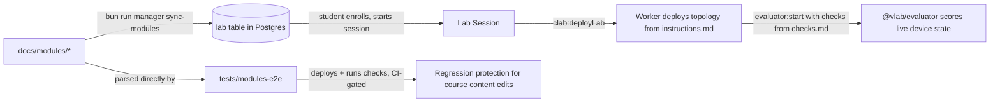

# Course Content (`docs/modules`)

- **`bun run manager sync-modules`** (`apps/manager/src/commands/sync-modules.ts`) syncs `docs/modules/` into the manager's database — these directories are the canonical seed/source for the "lab module" catalog students actually enroll in and complete.
- **`tests/modules-e2e`** directly parses and deploys these modules as Containerlab topologies to validate they still work — see [testing-ci.md](testing-ci.md).

## Structure

Six sequential modules, each a directory `docs/modules/<n>-<slug>/` with a consistent 5-file layout:

1. `1-pengenalan-cli` — Introduction to CLI (Linux shell vs. RouterOS CLI basics).
2. `2-konfigurasi-ip-address` — IP addressing configuration.
3. `3-konfigurasi-static-routing` — Static routing configuration.
4. `4-konfigurasi-routing-rip` — RIP dynamic routing.
5. `5-konfigurasi-routing-ospf` — OSPF dynamic routing.
6. `6-konfigurasi-routing-bgp` — BGP routing.

Each module directory contains:

| File              | Purpose                                                                                                                                                                                                                                                                                                                                                                                                                                              |
| ----------------- | ---------------------------------------------------------------------------------------------------------------------------------------------------------------------------------------------------------------------------------------------------------------------------------------------------------------------------------------------------------------------------------------------------------------------------------------------------- |
| `description.md`  | Title (`# ...`, parsed as the module title) + short overview + a bulleted "Tujuan Pembelajaran" (learning objectives) list.                                                                                                                                                                                                                                                                                                                          |
| `instructions.md` | Starts with an embedded `<!-- topology\n{ devices, links, groups, notes }\n-->` HTML-comment JSON block — the machine-readable topology definition (references device _templates_ by name, e.g. `"Mikrotik RouterOS"`, `"Ubuntu 24.04 SSH"`, with x/y canvas coordinates) — followed by human-readable Markdown instructions/scenario steps for students. **This file doubles as machine-readable topology config and human-readable instructions.** |
| `material.md`     | Deeper theory/reading material backing the module.                                                                                                                                                                                                                                                                                                                                                                                                   |
| `solution.md`     | Instructor-facing/reference solution/config.                                                                                                                                                                                                                                                                                                                                                                                                         |
| `checks.md`       | A Markdown table `\| Check ID \| Target Node \| Parameters \| Weight \|` mapping directly onto [`@vlab/evaluator`'s check registry](architecture/evaluator.md) (e.g. `mikrotik.system-identity`, `mikrotik.user-exist`, `linux.user-exist`).                                                                                                                                                                                                         |

## How this data flows through the system

This creates a tight, self-consistent loop: **course content (`docs/modules`) → seeded into the DB as lab definitions → evaluated at runtime by `@vlab/evaluator` using the same check IDs → regression-tested end-to-end by `tests/modules-e2e`, gated in CI** whenever any of `docs/modules/**`, `packages/@vlab/evaluator/**`, or `tests/modules-e2e/**` change.

## Parsing details (`tests/modules-e2e/src/module-parser.ts`)

`parseModule(modulePath)`:

- Extracts the `# Title` heading from `description.md`.
- Extracts the embedded `<!-- topology\n{...}\n-->` JSON block from `instructions.md` (`TopologyMarkdown`).
- Parses `checks.md`'s Markdown table into `ParsedCheck[]`, generating synthetic check IDs like `<targetNode>-<checkId-dashed>-<index>`.

`src/topology-builder.ts`/`src/configurator.ts` turn the parsed topology into a real Containerlab topology and apply base device configuration; `src/module.test.ts` is the Bun test entry that deploys, waits for health, runs the parsed checks through `@vlab/evaluator`, and tears the lab down for each module (or a single one via `MODULE=<name> bun run test:module`).

## Editing course content

If you add/change a module:

1. Keep the 5-file structure (`description.md`, `instructions.md`, `material.md`, `solution.md`, `checks.md`) — the parser expects all of them.
2. Check IDs in `checks.md` must match a real check registered in [`@vlab/evaluator`](architecture/evaluator.md) (`linux.*`, `mikrotik.*`, `node-interface.*`).
3. Device names referenced in `instructions.md`'s topology block must match real `device_template` names in the database (or whatever the target environment's device catalog contains).
4. Run `tests/modules-e2e` locally before relying on CI — it requires a real Containerlab + Docker environment (see [testing-ci.md](testing-ci.md)).
5. Run `bun run manager sync-modules` against your target environment to actually publish the change.
