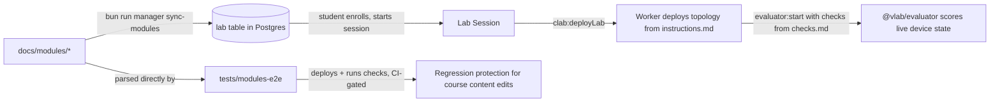

# Course Content (`docs/modules`)

- **`bun run manager sync-modules`** (`apps/manager/src/commands/sync-modules.ts`) syncs `docs/modules/` into the manager's database — these directories are the canonical seed/source for the "lab module" catalog students actually enroll in and complete.
- **`tests/modules-e2e`** directly parses and deploys these modules as Containerlab topologies to validate they still work — see [testing-ci.md](testing-ci.md).

## Structure

Six sequential modules, each a directory `docs/modules/<n>-<slug>/` with a consistent 5-file layout:

1. `1-pengenalan-cli` — Introduction to CLI (Linux shell vs. RouterOS CLI basics).
2. `2-konfigurasi-ip-address` — IP addressing configuration.
3. `3-konfigurasi-static-routing` — Static routing configuration.
4. `4-konfigurasi-routing-rip` — RIP dynamic routing.
5. `5-konfigurasi-routing-ospf` — OSPF dynamic routing.
6. `6-konfigurasi-routing-bgp` — BGP routing.

Each module directory contains:

| File              | Purpose                                                                                                                                                                                                                                                                                                                                                                                                                                              |
| ----------------- | ---------------------------------------------------------------------------------------------------------------------------------------------------------------------------------------------------------------------------------------------------------------------------------------------------------------------------------------------------------------------------------------------------------------------------------------------------- |
| `description.md`  | Title (`# ...`, parsed as the module title) + short overview + a bulleted "Tujuan Pembelajaran" (learning objectives) list.                                                                                                                                                                                                                                                                                                                          |
| `instructions.md` | Starts with an embedded `<!-- topology\n{ devices, links, groups, notes }\n-->` HTML-comment JSON block — the machine-readable topology definition (references device _templates_ by name, e.g. `"Mikrotik RouterOS"`, `"Ubuntu 24.04 SSH"`, with x/y canvas coordinates) — followed by human-readable Markdown in three lettered sections: **A. Skenario & Topologi**, **B. Referensi Perintah**, **C. Langkah-Langkah**. Section B is a generated `<!-- command-reference:start -->`…`<!-- command-reference:end -->` block holding a copy of `material.md`'s "Referensi Perintah" tables. It sits *before* the steps deliberately: in the session sidebar a trailing appendix would mean scrolling past every remaining step to reach it, whereas next to the addressing table it forms one lookup zone the student already scrolls to. **This file doubles as machine-readable topology config and human-readable instructions.** |
| `material.md`     | Deeper theory/reading material backing the module. Diagrams live in `assets/*.svg` alongside it and are resolved via md-to-pdf's `--basedir`. Print styling is `scripts/pdf-style.css`; page size, margins, the running header and page numbers are in `scripts/pdf-config.cjs` (Chrome has no `@page` margin boxes, so those can only come from Puppeteer templates). Its trailing "Referensi Perintah" section is the **source** for the copy embedded in `instructions.md` — edit it here, then run `bun run scripts:sync-command-reference`.                                                                                                                                                                                                                                                                                                                                                                                                   |
| `solution.md`     | Instructor-facing reference solution: the commands that take an empty topology to a fully passing lab, plus the answer key for the module's "Pertanyaan Pemahaman". **Executed verbatim by `tests/modules-e2e`**, so its fenced `routeros`/`bash` blocks must stay runnable and grouped under `## <NodeName> (...)` headings. |
| `questions.md`    | Conceptual "Pertanyaan Pemahaman" for the module, kept separate from `instructions.md` so the lab steps stay purely operational. **Not currently surfaced in the platform** — it is authored ahead of a future quiz/assessment feature. Answer keys live in `solution.md`. |
| `checks.md`       | A Markdown table `\| Check ID \| Target Node \| Parameters \| Weight \|` mapping directly onto [`@vlab/evaluator`'s check registry](architecture/evaluator.md) (e.g. `mikrotik.system-identity`, `mikrotik.user-exist`, `linux.user-exist`).                                                                                                                                                                                                         |

## How this data flows through the system

```mermaid
flowchart LR
    A[docs/modules/*] -->|bun run manager sync-modules| B[(lab table in Postgres)]
    B -->|student enrolls, starts session| C[Lab Session]
    C -->|clab:deployLab| D[Worker deploys topology from instructions.md]
    D -->|evaluator:start with checks from checks.md| E["@vlab/evaluator scores live device state"]
    A -->|parsed directly by| F[tests/modules-e2e]
    F -->|deploys + runs checks, CI-gated| G[Regression protection for course content edits]
```

This creates a tight, self-consistent loop: **course content (`docs/modules`) → seeded into the DB as lab definitions → evaluated at runtime by `@vlab/evaluator` using the same check IDs → regression-tested end-to-end by `tests/modules-e2e`, gated in CI** whenever any of `docs/modules/**`, `packages/@vlab/evaluator/**`, or `tests/modules-e2e/**` change.

## Parsing details (`tests/modules-e2e/src/module-parser.ts`)

`parseModule(modulePath)`:

- Extracts the `# Title` heading from `description.md`.
- Extracts the embedded `<!-- topology\n{...}\n-->` JSON block from `instructions.md` (`TopologyMarkdown`).
- Parses `checks.md`'s Markdown table into `ParsedCheck[]`, generating synthetic check IDs like `<targetNode>-<checkId-dashed>-<index>`.

- Parses `solution.md` into an ordered command list (`src/solution-parser.ts`).

`src/topology-builder.ts` turns the parsed topology into a real Containerlab topology; `src/solution-runner.ts` then executes the module's own `solution.md` against it, rather than synthesising config from `checks.md` (which would only ever prove `checks.md` agrees with itself). `src/module.test.ts` is the Bun test entry that deploys, waits for health, runs the solution, evaluates the parsed checks through `@vlab/evaluator`, and tears the lab down for each module (or a single one via `MODULE=<name> bun run test:module`).

`src/module-docs.test.ts` validates the four files against each other without Docker (`bun run test:module-docs`): `<LabCheck>` tag order must match `checks.md` row order, check ids and params must exist in the evaluator registry, and every device must be configured by `solution.md`. See [tests/modules-e2e/README.md](../../tests/modules-e2e/README.md).

## Editing course content

If you add/change a module:

1. Keep the 6-file structure (`description.md`, `instructions.md`, `material.md`, `questions.md`, `solution.md`, `checks.md`) — the parser expects all of them.
2. Check IDs in `checks.md` must match a real check registered in [`@vlab/evaluator`](architecture/evaluator.md) (`linux.*`, `mikrotik.*`, `node-interface.*`).
3. Device names referenced in `instructions.md`'s topology block must match real `device_template` names in the database (or whatever the target environment's device catalog contains).
4. After editing a "Referensi Perintah" table in `material.md`, run `bun run scripts:sync-command-reference` so the copy in `instructions.md` follows. `module-docs.test.ts` fails if the two drift.
5. Run `tests/modules-e2e` locally before relying on CI — it requires a real Containerlab + Docker environment (see [testing-ci.md](testing-ci.md)).
6. Run `bun run manager sync-modules` against your target environment to actually publish the change.
