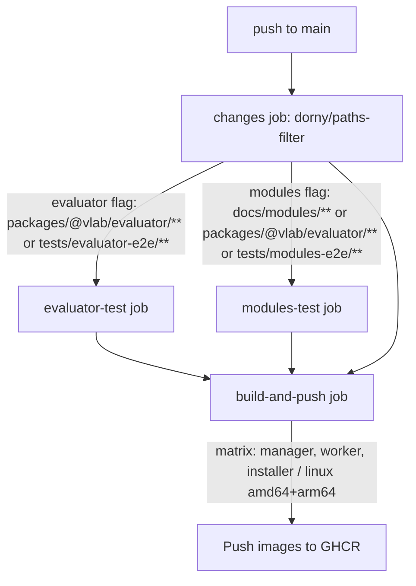

# Testing & CI/CD

## End-to-end test suites

Both suites are Bun workspace packages (`private: true`, run via `bun test`), requiring a **live Containerlab environment** (Bun ≥1.3, containerlab installed, Docker daemon, real container images) — these are genuine end-to-end infra tests, not unit tests.

### `tests/evaluator-e2e`

Tests the full [`@vlab/evaluator`](architecture/evaluator.md) pipeline against a real, ephemeral Containerlab topology.

- `src/evaluator.test.ts`: spins up a topology (`router1`/`router2` = `mikrotik_ros` via `ghcr.io/nunu27/vrnetlab/vr-routeros`, `linux1` = `ghcr.io/nunu27/docker-remote-desktop:ssh-ubuntu-24.04`, wired with explicit `stages.create["wait-for"]` so the Linux node waits for both routers to be healthy) using [`@vlab/clab`'s](architecture/clab.md) `Containerlab` class.
- Monitors health/interfaces via [`@vlab/clab-monitor`'s](architecture/clab-monitor.md) `createMonitor()`.
- Connects two live `RouterOSClient`s (with a local `connectWithRetry` — 5 retries / 5s delay, separate from the evaluator's own internal retry logic).
- Overrides `node-interface.interfaces-ip`'s read via `evaluator.setSourceRead()` to pull from the clab monitor's live interface map.
- Defines ~16 checks spanning Linux (`route-exist`, `user-exist`, `check-ip`) and MikroTik (`route-exist`, OSPF instance/area/interface-template/neighbor, RIP instance/interface-template, BGP instance/connection/session, `system-identity`, `user-exist`, `check-ip`).
- Creates an evaluator session wired to the clab monitor's health hooks, and asserts (via `session.onChange` + a `waitForCheck(checkId, timeoutMs)` promise helper) that every configured check eventually flips to `true` within a timeout — proving the reactive/self-healing evaluation pipeline works end-to-end against real network devices.
- Suite files (`src/suites/linux.ts`, `mikrotik.ts`, `node-interface.ts`) issue the actual device commands (via SSH/RouterOS API) that should make each check pass, then call `waitForCheck` to confirm detection.
- `src/context.ts` defines shared `TestContext`/`DeployedNode` types passed into each suite.

### `tests/modules-e2e`

Tests the full lifecycle (deploy → evaluate → teardown) of each student-facing lab module defined in [`docs/modules/`](course-content.md) — this validates the course content itself is functionally correct. See [course-content.md](course-content.md#parsing-details-testsmodules-e2esrcmodule-parserts) for the parser details.

- `src/module-parser.ts` — `parseModule(modulePath)` parses `description.md`/`instructions.md`/`checks.md` into a structured test fixture.
- `src/topology-builder.ts` / `src/configurator.ts` — turn the parsed topology into a real Containerlab topology and apply base device configuration.
- `src/module.test.ts` — for each module (or one selected via `MODULE=<name> bun run test:module`, wired through the `VLAB_MODULE` env var), deploys the topology, waits for node health, runs the parsed checks through `@vlab/evaluator`, and tears the lab down.

## CI/CD pipeline (`.github/workflows/build.yml`, "Build vLab")

Triggers on push to `main` (ignoring docs/markdown/compose/agent-config-only changes).

1. **`changes`** job — computes `evaluator` and `modules` change flags via path filtering.
2. **`evaluator-test`** job (conditional on the `evaluator` flag) — installs Bun + Containerlab, adds the runner to `clab_admins`, `bun install` in `tests/evaluator-e2e`, runs `sg clab_admins -c "bun run test"`.
3. **`modules-test`** job (conditional on the `modules` flag) — same Bun/Containerlab setup, additionally pre-pulls the RouterOS and Ubuntu-SSH images, runs the `tests/modules-e2e` suite.
4. **`build-and-push`** job — depends on all three above; runs `if: always() && (evaluator-test success/skipped) && (modules-test success/skipped) && changes success` (proceeds even if the e2e jobs were skipped due to no relevant changes, but not if they failed). Matrix-builds `manager`/`worker`/`installer` via `docker/build-push-action` for `linux/amd64,linux/arm64`, pushing to GHCR (`ghcr.io/nunu27/vlab-bun-{manager,worker,installer}`) with branch/sha/`latest` tags and GHA build cache scoped per component.

There is **no Turborepo/Nx task-graph orchestrator** in this repo (`turbo.json`/`nx.json` do not exist) — task parallelism is handled entirely by Bun's native `--filter` workspace support plus this hand-rolled path-filtering in GitHub Actions.

## Other quality gates

- **`bun run typecheck`** — `bun --filter='*' run typecheck` across every workspace.
- **`bun run check`/`check:ci`/`lint`/`format`** — Biome only (no ESLint/Prettier, per `AGENTS.md`).
- **`bun run validate-readmes`** — `bun test tests/readme-validator/validate.test.ts`, a meta-test enforcing every package has a compliant README.
- **`apps/web`** — `vitest` + `@testing-library/react` + `jsdom` (`bun run test`) for frontend unit/component tests.
- **Husky + lint-staged** — `biome check --write --unsafe` runs on staged `ts/tsx/js/jsx/json/css` files pre-commit.

See [`AGENTS.md`](../../AGENTS.md) §7 for the verification commands expected before presenting any code change in this repo.
