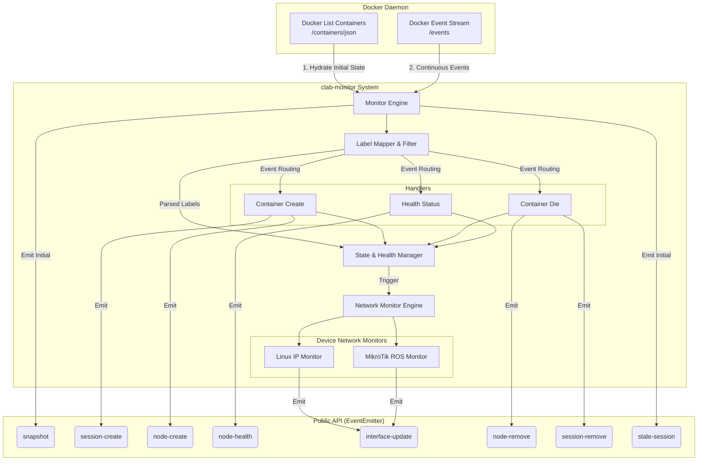

# @vlab/clab-monitor

`@vlab/clab-monitor` is a robust Node.js package designed to monitor Containerlab (clab) Docker environments. It acts as an abstraction layer over the raw Docker API, interpreting Docker events specifically through the lens of Containerlab deployments, providing structured, stateful tracking of network nodes, lab sessions, and internal network interfaces.

## 🏗️ Architecture & Underlying System

The system operates by hooking into the Docker Engine's event stream and filtering for containers that match specific Containerlab labels. It correlates individual container lifecycles into cohesive "lab sessions" and "nodes", maintaining an internal state of health and networking configurations.

### Core Components

1. **Monitor Engine (`index.ts`)**: The entry point that initializes the Docker event stream, performs state hydration by parsing already-running containers, and maintains the primary `EventEmitter`.
2. **Label Mapper & Filter (`types.ts`, `utils.ts`)**: Dynamically resolves custom user mappings alongside default `clab` labels (`clab-node-name`, `clab-node-kind`). It allows consumers to inject logic to define what constitutes a "temp" or "stale" container.
3. **Container Handlers (`container-handler.ts`)**: Specialized routers that react to specific Docker events:
   - `create`: Resolves node data, initiates network monitoring, and tracks session creation.
   - `die`: Cleans up network monitoring and handles node/session removal.
   - `health_status`: Tracks and broadcasts health check updates.
4. **Network Monitor (`network-monitor/`)**: An extensible subsystem that tracks the internal network interfaces (e.g., `eth0`, `veth1`) of nodes. Since different network OSes expose interfaces differently, it dynamically assigns a handler based on the `deviceKind` (e.g., `linux` via `ip a`, or `mikrotik_ros` via REST/API).

### System Flow Diagram



## 📡 List of Emitted Events

The package exposes a strongly typed `EventEmitter` that emits the following lifecycle events:

### `snapshot`
- **When**: Emitted once immediately upon monitor initialization (hydration phase).
- **Payload**: `{ sessions: SessionData[], nodes: NodeData[] }`
- **Description**: Provides the current existing state of all running lab sessions and nodes. Useful for aligning the application state with the Docker daemon at startup.

### `stale-session`
- **When**: Emitted during the hydration phase if a running container is detected as stale (determined by the user-provided `isStale` callback).
- **Payload**: `sessionId` (string)
- **Description**: Alerts the consumer that a previously running session is considered abandoned and should likely be destroyed.

### `session-create`
- **When**: Emitted when a new container is created that belongs to a previously unknown `sessionId`.
- **Payload**: `SessionData`
- **Description**: Signifies the start of a new Containerlab session/topology deployment.

### `session-remove`
- **When**: Emitted when a container dies and it was the *last* known container tracked for that specific `sessionId`.
- **Payload**: `sessionId` (string)
- **Description**: Signifies that an entire Containerlab topology has been taken down.

### `node-create`
- **When**: Emitted every time a new container belonging to a tracked session is created.
- **Payload**: `NodeData` (includes `nodeId`, `name`, `ip`, `health`, and initial `interfaces`)
- **Description**: Tracks the deployment of individual devices within a lab topology.

### `node-remove`
- **When**: Emitted every time a tracked container dies.
- **Payload**: `[nodeId: string, isTemp: boolean]`
- **Description**: Tracks the teardown or crash of an individual lab device.

### `node-health`
- **When**: Emitted when the Docker daemon fires a `health_status` event for a container.
- **Payload**: `[{ id: string, labSessionId: string, health: string | null }, isTemp: boolean]`
- **Description**: Tracks the internal readiness of a device (e.g., `starting`, `healthy`, `unhealthy`). Network interface extraction and monitoring are generally deferred until a node reaches the `healthy` state.

### `interface-update`
- **When**: Emitted dynamically by the device-specific `NetworkMonitor` when an internal interface change is detected (e.g., an interface is brought UP, given an IP, or added via a veth pair).
- **Payload**: `[{ id: string, labSessionId: string, interfaces: Record<string, string[]> }, isTemp: boolean]`
- **Description**: Provides a real-time map of interface names to their assigned IP addresses (e.g., `{ eth1: ["10.0.0.1/24", "fde4::1/64"] }`).

## 🛠 Usage Overview

```typescript
import { createMonitor } from "@vlab/clab-monitor";
import Docker from "dockerode";
import pino from "pino";

const docker = new Docker();
const logger = pino();

const monitor = createMonitor({
  docker,
  logger,
  mapping: {
    sessionId: "vlab-session-id",
    nodeId: "vlab-node-id",
  },
  // Optional filters
  filter: (data) => data.sessionId.startsWith("lab_"),
  isTemp: (data) => data.name.includes("temp"),
});

const { emitter, init } = monitor;

emitter.on("node-create", (node) => {
  console.log(`Node started: ${node.name} (${node.ip})`);
});

emitter.on("interface-update", (data) => {
  console.log(`Interfaces updated for ${data.id}:`, data.interfaces);
});

// Start listening and emit the initial snapshot
await init();
```
