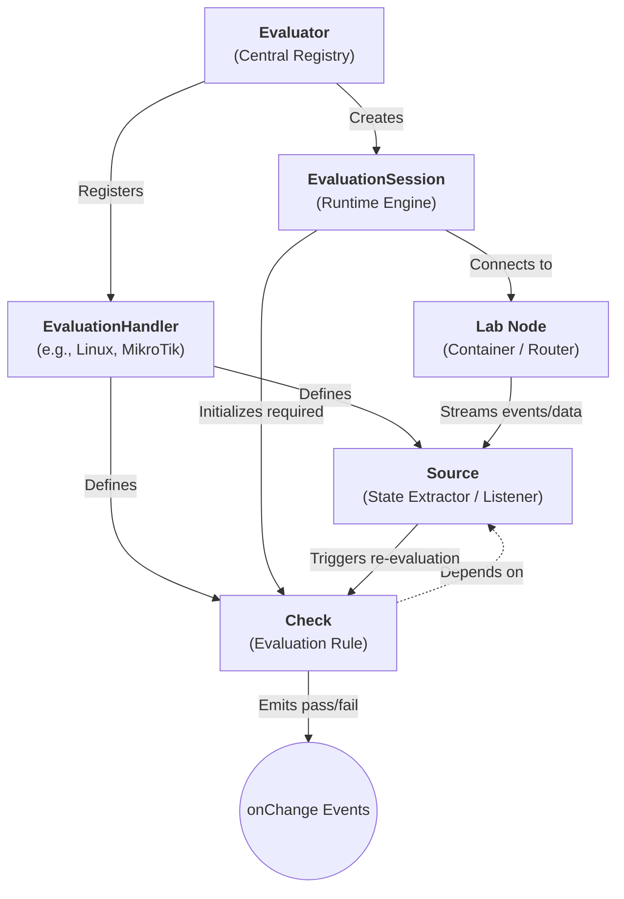

# @vlab/evaluator

The `@vlab/evaluator` package provides a robust, extensible, and event-driven evaluation engine used by vLab to continuously monitor and assess the state of lab environments, container nodes, and network devices.

## Underlying System Architecture

The evaluation system is built around three core concepts: **Handlers**, the **Evaluator** registry, and the **Evaluation Session**. It embraces a reactive and dependency-mapped design to ensure evaluations are extremely lightweight and evaluate immediately as state changes on the devices.



### 1. `EvaluationHandler`
Handlers define *how* to extract state (Sources) and *what* to evaluate (Checks) for a specific kind of node (e.g., Linux, MikroTik).
- **Context Builder**: Establishes the connection to the node. For a Linux node, it attaches via Docker modem; for a MikroTik router, it connects to the RouterOS API.
- **Sources**: Represents raw, typed state from the system (e.g., routing tables, OSPF instances, users). A Source defines a `read` method for reading the current value and a `listen` method to hook into real-time streaming (like `ip monitor` in Linux or `/log/listen` in MikroTik).
- **Checks**: Declarative evaluation rules that bind to a specific Source. They contain a handler function that returns `true` or `false` based on user-provided parameters and the current Source data. Checks can be marked as `oneTime` to stop listening once they pass.

### 2. `Evaluator`
The `Evaluator` is the central registry that aggregates all handlers. It tracks emitters, manages context type extraction, and serves as a factory for spinning up runtime sessions.

### 3. `EvaluationSession`
The runtime engine that executes the checks against the active lab. It performs intelligent dependency mapping:
- **Dependency Mapping**: When initialized with a list of required checks, the session determines exactly which Sources are needed. It *only* connects to and streams from the Sources that are strictly required by active checks.
- **Debounced Updates**: As streams (like `/log/listen` or `inotifywait`) trigger changes, the system debounces the corresponding `read()` operations to batch updates efficiently.
- **Event-Driven Lifecycle**: When source data is fetched, the session propagates it to the specific checks that depend on it, invoking their evaluator functions and firing `onChange` events when check status transitions between pass/fail.

---

## Supported Evaluators (Handlers)

### 1. Linux Handler (`linux`)
Monitors state inside Docker containers using `dockerode` and lightweight Linux tools.

#### Sources & Checks
- **Source: `routing`** (Listens via `ip -o monitor route`)
  - **Check: `route-exist`**: Validates a specific route exists. Parameters: `dst` (Destination), `gateway` (Gateway IP).
- **Source: `users`** (Listens via `inotifywait` on `/etc/passwd`)
  - **Check: `user-exist`**: Validates a user exists on the system. Parameters: `username`.

### 2. MikroTik Handler (`mikrotik`)
Monitors MikroTik RouterOS devices via the `mikro-routeros` API. It uses the API's `/listen` commands for reactive, event-driven updates.

#### Sources & Checks
- **Source: `routing-table`** (Reacts to `/log/listen` route changes)
  - **Check: `route-exist`**: Validates the presence of routes. Parameters: `dst`, `gateway`, `flag` (e.g., A for Active, D for Dynamic).
- **Source: `ospf-instance`** (Listens via `/routing/ospf/instance/listen`)
  - **Check: `ospf-instance-exist`**: Parameters: `name`, `version`, `routerId`, `flag`.
- **Source: `ospf-area`** (Listens via `/routing/ospf/area/listen`)
  - **Check: `ospf-area-exist`**: Parameters: `name`, `instance`, `areaId`, `flag`.
- **Source: `ospf-interface-template`** (Listens via `/routing/ospf/interface-template/listen`)
  - **Check: `ospf-interface-template-exist`**: Parameters: `interfaces`, `area`, `flag`.
- **Source: `ospf-neighbor`** (Listens via `/routing/ospf/neighbor/listen`)
  - **Check: `ospf-neighbor-exist`**: Validates OSPF adjacency. Parameters: `area`, `interface`, `state` (e.g., Full, 2-Way).
- **Source: `rip-instance`**
  - **Check: `rip-instance-exist`**: Parameters: `name`, `flag`.
- **Source: `rip-interface-template`**
  - **Check: `rip-interface-template-exist`**: Parameters: `instance`, `interfaces`, `flag`.
- **Source: `bgp-instance`**
  - **Check: `bgp-instance-exist`**: Parameters: `name`, `as`, `routerId`, `flag`.
- **Source: `system-identity`**
  - **Check: `system-identity`**: Validates the router's hostname. Parameters: `name`.

### 3. Node Interface Handler (`node-interface`)
A generic handler for static configuration tracking, typically used for basic connectivity and state insertion outside of the container runtimes.
- **Source: `interfaces-ip`**
  - **Check: `check-ip`**: Verifies an interface holds a specific IP. Parameters: `interface`, `ip`.

---

## Getting Started

To install dependencies:

```bash
bun install
```

To typecheck:

```bash
bun run check
```
